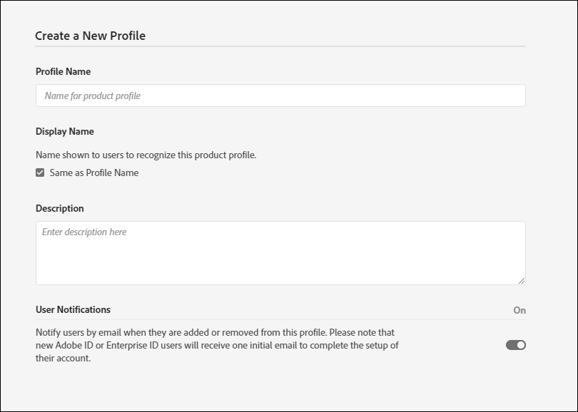

# 設定自動表單轉換服務 {#about-this-help}

本說明說明AEM管理員如何設定Automated forms conversion服務，以自動將其PDF forms轉換為最適化表單。 本說明適用於貴組織的IT和AEM管理員。 提供的資訊基於以下假設：閱讀本幫助的任何人都熟悉以下技術：

* 安裝、設定和管理Adobe Experience Manager和AEM套件、

* 使用Linux®和Microsoft® Windows®作業系統，

* 配置SMTP郵件伺服器

<!--- >[!VIDEO](https://video.tv.adobe.com/v/29267/) 

**Watch the video or read the article to configure Automated Forms Conversion service** -->

## 入門{#onboarding}

AEM 6.4 Forms和AEM 6.5 Forms內部部署定期客戶和Adobe管理服務企業客戶可免費使用本服務。 您可以聯絡 Adobe Sales 團隊或您的 Adobe 代表，請求存取該服務。AEM Forms作為Cloud Service客戶，也可免費使用並預先啟用此服務。

Adobe 為您的組織啟用存取權限，並向您指定的組織管理員提供所需的特權。 管理員可以授予組織的 AEM Forms 開發人員（使用者）存取權限以連接到該服務。 

## 必備條件 {#prerequisites}

您需要下列項目才能使用Automated forms conversion服務：

* automated forms conversion服務已為貴組織啟用
* 具有轉換服務管理員權限的Adobe ID帳戶
* 以具有最新AEM Service Pack或最新更新之Cloud Service製作例項的形式啟動並執行AEM 6.4、AEM 6.5或AEM Forms。
* 屬於表單使用者群組成員的AEM使用者(在您的AEM例項上)

## 設定環境 {#setuptheservice}

使用服務之前，請準備您的AEM製作執行個體以連線至在Adobe雲端上執行的服務。 以所列順序執行下列步驟，為服務準備執行個體：

1. [下載並安裝AEM 6.4、AEM 6.5或以AEM Forms為Cloud Service板載](#aemquickstart)
1. [下載並安裝最新的AEM Service Pack](#servicepack)
1. [下載並安裝最新的AEM Forms附加元件套件](#downloadaemformsaddon)
1. （可選）[下載並安裝最新的連接器封裝](#installConnectorPackage)
1. [建立自訂主題和範本](#referencepackage)

### 下載並安裝AEM 6.4或AEM 6.5或以AEM Forms為Cloud Service板載 {#aemquickstart}


automated forms conversion服務會在AEM製作執行個體上執行。 您需要AEM 6.4、AEM 6.5或AEM Forms作為Cloud Service，才能設定AEM製作例項。

* 如果AEM 6.4或AEM 6.5尚未啟動並執行，請從下列位置下載。 下載AEM後，如需設定AEM製作例項的指示，請參閱[部署和維護](https://helpx.adobe.com/experience-manager/6-5/sites/deploying/using/deploy.html#defaultlocalinstall)。

   * 如果您是現有AEM客戶，請從[Adobe授權網站](http://licensing.adobe.com)下載AEM 6.4或AEM 6.5。

   * 如果您是Adobe合作夥伴，請使用[Adobe合作夥伴培訓計畫](https://adobe.allegiancetech.com/cgi-bin/qwebcorporate.dll?idx=82357Q)來請求AEM 6.4或AEM 6.5。

* 如果您使用AEM Forms作為Cloud Service，請參閱板載[AEM Forms作為Cloud Service](https://experienceleague.adobe.com/docs/experience-manager-forms-cloud-service/forms/setup-environment/setup-forms-cloud-service.html?lang=en#setup-environment)和[設定本機開發環境](https://experienceleague.adobe.com/docs/experience-manager-forms-cloud-service/forms/setup-environment/setup-local-development-environment.html?lang=en#setup-environment)。

### (僅限AEM 6.4和AEM 6.5)下載並安裝AEM最新版Service Pack {#servicepack}

下載並安裝最新的AEM Service Pack。 如需詳細指示，請參閱[AEM 6.4 Service Pack發行說明](https://helpx.adobe.com/tw/experience-manager/6-4/release-notes/sp-release-notes.html)或[AEM 6.5 Service Pack發行說明](https://helpx.adobe.com/tw/experience-manager/6-5/release-notes/sp-release-notes.html)。

### (僅限AEM 6.4和AEM 6.5)下載及安裝AEM Forms附加元件套件  {#downloadaemformsaddon}

AEM例項包含基本表單功能。 轉換服務需要完整的AEM Forms功能。 下載並安裝AEM Forms附加套件，以運用AEM Forms的所有功能。 設定和執行轉換服務需要套件。 有關詳細說明，請參閱[安裝和配置資料捕獲功能。](https://helpx.adobe.com/experience-manager/6-5/forms/using/installing-configuring-aem-forms-osgi.html)

>[!NOTE]
> 安裝附加套件後，請務必執行強制安裝後設定。


<!-- ### (Optional) Download and install connector package  {#installConnectorPackage}

The connector package provides early access to the [Auto-detect logical sections](convert-existing-forms-to-adaptive-forms.md#run-the-conversion) features and improvements delivered in release AFC-2020.03.1. Do not install the package if you do not require feature and improvements delivered in AFC-2020.03.1.  You can [download the connector package from AEM Package Share](https://www.adobeaemcloud.com/content/marketplace/marketplaceProxy.html?packagePath=/content/companies/public/adobe/packages/cq650/featurepack/AFCS-Connector-2020.03.1). -->


### 建立自訂主題和範本 {#referencepackage}

如果您在[生產模式](https://helpx.adobe.com/experience-manager/6-5/sites/administering/using/production-ready.html)（nosamplecontent運行模式）中啟動AEM 6.4或AEM 6.5，則不會安裝引用包。 參考包包含示例主題和模板。 automated forms conversion服務至少需要一個主題和一個範本，才能將PDF表單轉換為最適化表單。 建立您自己的自定義主題和模板，並指向[服務配置](#configure-the-cloud-service)以在使用服務之前使用自定義模板和主題。

您也可以在Author例項上下載並安裝[AEM Forms參考資產](https://experience.adobe.com/#/downloads/content/software-distribution/en/aemcloud.html)套件。 它會建立一些參考主題和範本。

## 設定服務 {#configure-the-service}

在您繼續設定服務並連線本機執行個體與在Analytics Cloud上執行的服務之前，請先了解連線至服務所需的角色和權限。 此服務使用兩種不同類型的角色：管理員和開發人員：

* **管理員**:管理員負責管理其組織的Adobe軟體和服務。管理員可授予其組織中開發人員的存取權，以連線至在Adobe雲端上執行的Automated forms conversion服務。 為組織布建管理員時，管理員會收到標題為&#x200B;**[!UICONTROL 'You now have administrator rights to manage Adobe software and services for your organization']**&#x200B;的電子郵件。 如果您是管理員，請檢查郵箱中是否有前面提到的標題，然後繼續[授予組織開發人員的訪問權限](#adduseranddevs)。


* **開發人員**:開發人員會將本機的AEM Forms製作例項連結至在Adobe雲端上執行的Automated forms conversion服務。當管理員授予開發人員連線至Automated forms conversion服務的權限時，會傳送標題為您現在擁有開發人員存取權以管理組織的AdobeAPI整合的電子郵件給開發人員。 如果您是開發人員，請查看信箱中是否有前述標題的電子郵件，並繼續[連線您本機的AEM執行個體至Adobe雲上的Automated forms conversion服務。](#connectafcadobeio)


### (僅適用於AEM 6.4和AEM 6.5的管理員)授予組織的開發人員存取權 {#adduseranddevs}

在Adobe為您的組織啟用訪問權限並向管理員提供所需權限後，管理員可以登錄Admin Console（下面的詳細說明）、建立配置檔案以及向配置檔案添加開發人員。 開發人員可將AEM Forms的本機執行個體連結至Adobe雲端上的Automated forms conversion服務。

開發人員是指定用來執行轉換服務的組織成員。 只有新增至AdobeAutomated forms conversion服務設定檔的開發人員才有權使用Automated forms conversion服務。 執行下列步驟來建立設定檔，並新增開發人員。 您至少需要一個設定檔，才能授予組織開發人員所需的存取權：

1. 登入[Admin Console](https://adminconsole.adobe.com/)。 使用已布建的管理員的&#x200B;**Adobe ID** ，以使用Automated forms conversion服務登入。 請勿使用任何其他ID或Federated ID登入。
1. 按一下&#x200B;**[!UICONTROL Automated Forms Conversion]**&#x200B;選項。
1. 按一下&#x200B;**[!UICONTROL Products]**&#x200B;標籤中的&#x200B;**[!UICONTROL New Profile]**。
1. 為設定檔指定&#x200B;**[!UICONTROL Name]**、**[!UICONTROL Display Name]**&#x200B;和&#x200B;**[!UICONTROL Description]**。 按一下 **[!UICONTROL Done]**. 已建立設定檔。

   

1. 將開發人員新增至設定檔。 若要新增開發人員：
   1. 在[Admin Console](https://adminconsole.adobe.com/enterprise)中，導覽至概述標籤。
   1. 按一下所需產品卡上的&#x200B;**[!UICONTROL Assign Developers]**。
   1. 輸入開發人員的電子郵件地址，以及（可選）名字和姓氏。
   1. 選取產品設定檔。 點選&#x200B;**[!UICONTROL Save]**。

對所有使用者重複上述步驟。 如需新增開發人員的詳細資訊，請參閱[管理開發人員](https://helpx.adobe.com/enterprise/using/manage-developers.html)。

一旦管理員將開發人員新增至Adobe I/O設定檔，開發人員就會透過電子郵件收到通知。 收到電子郵件後，開發人員可以繼續[連線本機AEM Forms執行個體與Adobe雲端上的Automated forms conversion服務](#connectafcadobeio)。

### （僅限開發人員使用）將您本機的AEM Forms執行個體連線至Adobe雲端上的Automated forms conversion服務 {#connectafcadobeio}

管理員提供開發人員存取權後，您就可以將本機的AEM Forms執行個體連線至Automated forms conversion服務，該服務會在Analytics Cloud上執行。 以所列順序執行下列步驟，將您的AEM Forms執行個體連結至服務：

* [設定電子郵件通知](configure-service.md#configureemailnotification)
* [將使用者新增至表單使用者群組](#adduserstousergroup)
* [取得公開憑證](#obtainpubliccertificates)
* [在Adobe開發人員控制台上設定服務API](#createintegration)
* [設定雲端服務](configure-service.md#configure-the-cloud-service)

#### 設定電子郵件通知 {#configureemailnotification}

automated forms conversion服務使用Day CQ郵件服務來傳送電子郵件通知。 這些電子郵件通知包含有關成功或失敗轉換的資訊。 如果您選擇不接收通知，請跳過這些步驟。 執行下列步驟以設定Day CQ Mail Service:

* 若使用AEM 6.4 Forms或AEM 6.5 Forms:

   1. 前往`http://localhost:4502/system/console/configMgr`的AEM Configuration Manager
   1. 開啟Day CQ Mail Service設定。 為&#x200B;**[!UICONTROL SMTP server host name]**、**[!UICONTROL SMTP server port]**&#x200B;和&#x200B;**[!UICONTROL From address]**&#x200B;欄位指定值。 按一下 **[!UICONTROL Save]**.

      有關SMTP伺服器的主機名和埠的資訊，可以與電子郵件服務提供商或IT管理員聯繫。 您可以在「寄件者」欄位中使用任何有效的電子郵件地址。 例如，notification@example.com或donotreply@example.com。

   1. 開啟&#x200B;**[!UICONTROL Day CQ Link Externalizer]**&#x200B;配置。 在&#x200B;**[!UICONTROL Domains]**&#x200B;欄位中，指定本機、製作和發佈執行個體的實際主機名稱或IP位址和連接埠號。 按一下 **[!UICONTROL Save]**.

* 若使用AEM Forms作為Cloud Service，請[記錄支援票證以啟用電子郵件服務](https://experienceleague.adobe.com/docs/experience-manager-cloud-service/implementing/developing/development-guidelines.html?lang=en#sending-email)。

#### 將使用者新增至表單使用者群組 {#adduserstousergroup}

在指定用來執行服務的AEM使用者的設定檔中指定電子郵件地址。 確保用戶是[forms user](https://experienceleague.adobe.com/docs/experience-manager-65/forms/manage-administer-aem-forms/forms-groups-privileges-tasks.html)組的成員。 電子郵件會傳送至執行轉換之使用者的電子郵件地址。 要指定用戶的電子郵件地址並將用戶添加到表單用戶組：

1. 以AEM管理員身分登入您的AEM Forms製作執行個體。 使用您的本機AEM憑證登入。 請勿使用Adobe ID登入。 點選&#x200B;**[!UICONTROL Adobe Experience Manager]** > **[!UICONTROL Tools]** > **[!UICONTROL Security]** > **[!UICONTROL Users]**。

1. 選取指定用來執行轉換服務的使用者，然後點選&#x200B;**[!UICONTROL Properties]**。 將開啟「編輯用戶設定」頁。
1. 在&#x200B;**[!UICONTROL Email]**&#x200B;欄位中指定電子郵件地址，然後點選&#x200B;**[!UICONTROL Save]**。 成功完成或轉換失敗時，會傳送電子郵件至指定的電子郵件地址。
1. 點選&#x200B;**群組**&#x200B;標籤。 在「選擇組」頁簽中，鍵入並選擇&#x200B;**forms-users**&#x200B;組。 點選&#x200B;**儲存並關閉**。 使用者現在是表單使用者群組的成員。

#### (僅限AEM 6.4和AEM 6.5)取得公開憑證 {#obtainpubliccertificates}

公開憑證可讓您在Adobe I/O時驗證設定檔。

1. 登入您的AEM Forms製作例項。 導航到 **[!UICONTROL Tools]**> **[!UICONTROL Security]** > **[!UICONTROL Adobe IMS Configurations]**. 點選&#x200B;**[!UICONTROL Create]**。 此時將顯示&#x200B;**[!UICONTROL Adobe IMS Technical Account Configuration]**&#x200B;頁。

   

1. 在雲端解決方案中選取&#x200B;**[!UICONTROL Automated Forms Conversion Service]**。

1. 選中&#x200B;**[!UICONTROL Create new certificate]**&#x200B;複選框並指定別名。 別名的作用是對話方塊的名稱。點選&#x200B;**[!UICONTROL Create certificate]**。 對話方塊隨即顯示。按一下 **[!UICONTROL OK]**. 憑證已建立。

1. 點選&#x200B;**[!UICONTROL Download Public Key]**&#x200B;並將&#x200B;*AEM-Adobe-IMS.crt*&#x200B;憑證檔案儲存在電腦上。 憑證檔案可用於[在Adobe開發人員控制台](#createintegration)上設定服務API。 點選&#x200B;**[!UICONTROL Next]**。

1. 指定下列項目：

   * 標題：指定標題。
   * 授權伺服器：[https://ims-na1.adobelogin.com&lt;a1/\](https://ims-na1.adobelogin.com)

   暫時將其他欄位留空（稍後將提供）。 保持頁面開啟。

   <!--
   Comment Type: draft

   <li> </li>
   -->

   <!--
   Comment Type: draft

   <li>Step text</li>
   -->

#### (僅限AEM 6.4和AEM 6.5)在Adobe開發人員控制台上設定服務API {#createintegration}

若要使用Automated forms conversion服務，請建立專案，並將Automated Forms Configuration Service API新增至Adobe開發人員控制台上的專案。 整合會產生API金鑰、用戶端密碼、裝載(JWT)。

1. 登入[https://console.adobe.io/](https://console.adobe.io/)。 使用您的Adobe ID，即您的管理員已布建的登入Adobe I/O主控台以登入的開發人員帳戶。
1. 從右上角選取您的組織。 如果您不清楚自己的組織為何，請聯絡您的管理員。
1. 點選&#x200B;**[!UICONTROL Create new project]**。 隨即顯示開始使用新專案的畫面。 點選&#x200B;**[!UICONTROL Add API]**。 畫面會顯示為您的帳戶啟用所有API的清單。
1. 選取&#x200B;**[!UICONTROL Automated Forms Conversion service]**&#x200B;並點選&#x200B;**[!UICONTROL Next]**。 畫面隨即顯示設定API的畫面。
1. 選取[!UICONTROL Upload your public key]選項，上傳下載於[取得公開憑證](#obtainpubliccertificates)區段的AEM-Adobe-IMS.crt檔案，然後點選&#x200B;**[!UICONTROL Next]**。 將顯示「建立新服務帳戶(JWT)」憑據選項。 點選&#x200B;**[!UICONTROL Next]**。
1. 選取產品設定檔，然後點選&#x200B;**[!UICONTROL Save configured API]**。 選取在[授予組織開發人員存取權時建立的設定檔](#adduseranddevs)。 如果您不知道要選取的設定檔，請聯絡您的管理員。
1. 點選&#x200B;**[!UICONTROL Service Account (JWT)]**&#x200B;以檢視API金鑰、用戶端密碼，以及將您的本機AEM執行個體連線至Automated forms conversion服務所需的其他資訊。 頁面上的資訊可用來在本機電腦上建立IMS設定。

1. 開啟本機執行個體上的IMS設定頁面。 在[取得公開憑證](#obtainpubliccertificates)這一節的結尾，您已保持此頁面開啟。

   

1. 在AdobeIMS技術頁面上，指定API金鑰和用戶端密碼。 使用「Adobe開發人員控制台」頁面的「服務帳戶(JWT)」上指定的值。

   >[!NOTE]
   >
   >
   >對於裝載，請使用Adobe開發人員控制台的服務帳戶(JWT)頁面的產生JWT標籤中提供的程式碼。

1. 點選&#x200B;**[!UICONTROL Save]**。 已建立IMS設定。

   >[!CAUTION]
   >
   >僅建立一個IMS設定。 請勿建立多個IMS設定。

1. 選取IMS設定，然後點選&#x200B;**[!UICONTROL Check Health]**。 對話方塊隨即顯示。點選&#x200B;**[!UICONTROL Check]**。 成功連線時，*已成功擷取 Token* 訊息就會顯示。

   

   <br/> <br/>

#### 設定Cloud Service {#configure-the-cloud-service}

建立Cloud Service設定以將您的AEM執行個體連線至轉換服務。 它也可讓您指定轉換的範本、主題和表單片段。 您可以為每組表單分別建立多個雲端服務設定。 例如，您可以為銷售部門表單設定個別的設定，以及為客戶支援表單設定個別的設定。 執行下列步驟以建立雲端服務設定：

1. 在您的AEM Forms執行個體上，點選&#x200B;**[!UICONTROL Adobe Experience Manager]** > **[!UICONTROL Tools]**> **[!UICONTROL Cloud Services]** > **[!UICONTROL Automate Forms Conversion Configuration]**。
1. 點選&#x200B;**[!UICONTROL Global]**&#x200B;資料夾，然後點選&#x200B;**[!UICONTROL Create]**。 將顯示建立Automated forms conversion配置的頁。 配置在全局資料夾中建立。 您也可以在現有的其他資料夾中建立設定，或為設定建立資料夾。

1. 在&#x200B;**[!UICONTROL Create Automated Forms Conversion Configuration]**&#x200B;頁面上，指定下列欄位的值，然後點選&#x200B;**[!UICONTROL Next]**。

   | 欄位 | 說明 |
   |--- |--- |
   | 標題 | 設定的唯一標題。 標題會顯示在用於開始轉換的UI中。 |
   | 名稱 | 配置的唯一名稱。 設定會以指定名稱儲存在CRX-Repository中。 名稱可以與標題相同。 |
   | 縮圖位置 | 設定縮圖的位置。 |
   | 服務 URL | automated forms conversion服務在Adobe雲上的URL。 使用`https://aemformsconversion.adobe.io/` URL。 |
   | 範本 | 要套用至轉換表單的預設範本。 開始轉換之前，您一律可以指定不同的範本。 範本包含最適化表單的基本結構和初始內容。 您可以從現成可用的範本中選擇範本。 您也可以建立自訂範本。 |
   | 主題 | 要套用至轉換表單的預設主題。 開始轉換之前，您一律可以指定不同的主題。  您可以按一下圖示，選擇現成可用的主題。 您也可以建立自訂主題。 |
   | 現有片段 | 現有片段的位置（如果有）。 |
   | 自訂元模型 | 自訂中繼模型的.schema.json檔案路徑。 您可以為英文、法文、德文和西班牙文語言建立不同的元模型。 |

1. 在&#x200B;**[!UICONTROL Create Automated Forms Conversion Configuration]**&#x200B;頁面的&#x200B;**[!UICONTROL Advanced]**&#x200B;標籤中，指定以下欄位的值：

   <table>
   <thead>
   <tr>
   <th>欄位</th>
   <th>說明</th>
   </tr>
   </thead>
   <tbody>
   <tr>
   <td >產生記錄文件</td>
   <td>選擇為轉換的表單自動生成記錄文檔的選項。 選項僅適用於XFA型表單(XDP和PDF forms)。 當您啟用此選項時，在提交表單後，您可以允許客戶以打印或文檔格式記錄他們在表單中填寫的資訊，以供其將來參考。 這稱為記錄檔案。</td>
   </tr>
   <tr>
   <td>啟動 Analytics</td>
   <td>(僅限AEM 6.4和AEM 6.5)選取選項，以在所有轉換的表單上啟用Adobe Analytics。 使用選項之前，請確定已為您的AEM Forms例項啟用Adobe Analytics。</td>
   </tr>
   </tbody>
   </table>

   * 如果來源是副檔名為.XDP的XFA型表單，則輸出DOR會保留XFA版面，否則轉換服務會使用現成可用的範本，為其他XFA型表單產生DOR。
   * 提交XFA表單時，表單的提交資料會儲存為XML元素或屬性。 例如， `<Amount currency="USD"> 10.00 </Amount>`。 貨幣會儲存為屬性和貨幣金額，而10.00會儲存為元素。 適用性表單的提交資料沒有屬性，只有元素。 因此，當以XFA為基礎的表單轉換為最適化表單時，最適化表單提交資料包含每個此類屬性的元素。 例如，

   ```css
      {
         "Type": "Principal",
   
         "Amount": "10.00",
   
         "currency": "USD"
      }
   ```

1. 點選&#x200B;**[!UICONTROL Create]**。 雲端設定此時已建立。您的AEM Forms執行個體已準備好開始將舊版表單轉換為最適化表單。
