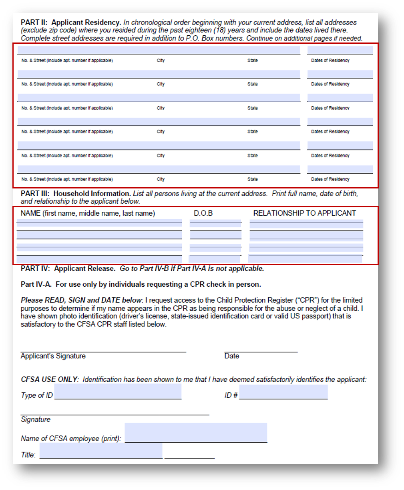

# 最佳實務和考量 {#do-not-publish-best-practices-and-considerations}

<!--
[DO NOT PUBLISH]
-->

AEM Forms自動轉換服務會將PDF表單轉換為最適化表單。 此服務使用人工智慧和機器學習演演算法來瞭解來源表單的版面和欄位。 每個機器學習服務都會持續學習來源資料，並在每次流失時產生改善的輸出。 這些服務像人類一樣從經驗中學習。

automated forms conversion服務會接受大量表單的訓練。 它可輕鬆識別來源表單中的欄位並產生調適型表單。 不過，PDF forms中有些欄位和樣式肉眼很容易看到，但此服務卻難以理解。 此服務可將與適用欄位型別或面板不同的欄位型別或面板指派給某些欄位或樣式。 以下列出所有此類欄位和樣式模式。

當服務不斷從來源資料學習時，就會開始識別並指派正確的欄位或面板給這些模式。 目前，您可以使用 [檢閱並更正](review-correct-ui-edited.md) 編輯器以修正此類問題。 在開始修正問題或進一步閱讀之前，請先熟悉 [最適化表單元件](https://helpx.adobe.com/experience-manager/6-5/forms/using/introduction-forms-authoring.html).

## 一般 {#general}

<table border="1" cellpadding="1" cellspacing="0" style="border-collapse: separate; border-spacing: 0px;" width="100%"> 
 <tbody>
  <tr>
   <td width="30%">已知的模式和解析度</td> 
   <td width="70%">範例</td> 
  </tr>
   <td>
<strong>模式</strong>
 
服務無法將填入的PDF forms轉換為最適化表單。
 
 
 
<strong>解析度</strong>
 
使用空白的最適化表單。
 </td> 
   <td style="text-align: left;"></td> 
  </tr>
  <tr>
   <td>
<strong>模式</strong>
 
服務可能無法識別密集表單中的文字和欄位。
 
 
 
<strong>解析度</strong>
 
在開始轉換之前，增加密集表單的文字和欄位之間的寬度。
 </td> 
   <td style="text-align: left;"></td> 
  </tr>
  <tr>
   <td>
<strong>模式</strong>
 
服務不支援掃描的表單。
 
 
 
<strong>解析度</strong>
 
請勿使用掃描的表單。 
 </td> 
   <td></td> 
  </tr>
  <tr>
   <td>
<strong>模式</strong>
 
服務不會擷取影像中的影像和文字。 
 
 
 
<strong>解析度</strong>
 
手動將影像或文字新增至轉換後的表單。
 </td> 
   <td></td> 
  </tr>
  <tr>
   <td>
<strong>模式</strong>
 
具有虛線或非清除邊界與邊界的表格不會轉換。
 
<strong>解析度</strong>
 
使用具有明確邊界和框線的表格。 支援。
 </td> 
   <td></td> 
  </tr>
 </tbody>
</table>

## 選擇群組  {#choice-group}

<table border="1" cellpadding="1" cellspacing="0" width="100%"> 
 <tbody>
  <tr>
   <td width="30%">模式</td> 
   <td width="70%">範例</td> 
  </tr>
  <tr>
   <td>
<strong>模式</strong>
 
具有方塊或圓圈以外形狀的選擇群組選項不會轉換為對應的最適化表單元件。 
 
 
 
<strong>解析度</strong>
 
將選擇選項形狀變更為方塊或圓形，或使用「檢閱並修正」編輯器來識別形狀。
 </td> 
   <td> </td> 
  </tr>
 </tbody>
</table>

## 表單欄位 {#form-fields}

<table border="1" cellpadding="1" cellspacing="0" width="100%"> 
 <tbody>
  <tr>
   <td width="30%">模式</td> 
   <td width="70%">範例</td> 
  </tr>
  <tr>
   <td width="25%">
<strong>模式</strong>
 
沒有清晰的邊界，服務無法識別欄位。
 
 
 
<strong>解析度</strong>
 
使用「稽核並修正」編輯器來識別此類欄位。
 
 
 
 
 </td> 
   <td width="50%">  </td> 
  </tr>
  <tr>
   <td>
<strong>模式</strong>
 
服務會留下一些表單欄位，其底部或右側的字幕未識別。
 
 
 
<strong>解析度</strong>
 
使用「稽核並修正」編輯器來識別此類欄位
 </td> 
   <td>    </td> 
  </tr>
  <tr>
   <td>
<strong>模式</strong>
 
服務會合併或指派錯誤的型別給一些彼此非常接近或沒有明確邊界的表單欄位。 
 
 
 
<strong>解析度</strong>
 
使用「稽核並修正」編輯器來識別此類欄位。
 </td> 
   <td></td> 
  </tr>
  <tr>
   <td>
<strong>模式</strong>
 
服務可能無法識別字幕很遠的欄位或字幕與輸入欄位之間的虛線。
 
 
 
<strong>解析度</strong>
 
使用具有明確界限的表單欄位，或使用檢閱和修正編輯器來修正此類問題。
 </td> 
   <td></td> 
  </tr>
 </tbody>
</table>

## 清單 {#lists}

<table border="1" cellpadding="1" cellspacing="0" width="100%"> 
 <tbody>
  <tr>
   <td width="30%">模式</td> 
   <td width="70%">範例</td> 
  </tr>
  <tr>
   <td>
<strong>模式</strong>
 
包含表單欄位的清單會合併或未轉換為對應的最適化表單元件
 
<strong>解析度</strong>
 
使用具有明確界限的表單欄位，或使用檢閱和修正編輯器來修正此類問題。
 </td> 
   <td></td> 
  </tr>
  <tr>
   <td>
<strong>模式</strong>
 
服務可能會保留一些無法識別的巢狀清單
 
 
 
<strong>解析度</strong>
 
使用檢閱和修正編輯器來修正此類問題。
 </td> 
   <td> </td> 
  </tr>
  <tr>
   <td>
<strong>模式</strong>
 
服務會合併一些包含選擇群組的清單
 
<strong>解析度</strong>
 
使用檢閱和修正編輯器來修正此類問題。
 </td> 
   <td> </td> 
  </tr>
 </tbody>
</table>

<!--
Comment Type: draft

<h3>Choice groups</h3>
-->

<!--
Comment Type: draft

<ul>
<li>Lists with form fields, nested lists, and nested choice groups are not supported.</li>
<li>Form fields with captions at bottom or right are not supported.</li>
<li>Form fiields without bordes are not supported.</li>
<li>Hidden form fields are not supported.</li>
<li>Button in PDF forms are not converted to adaptive form buttons.  </li>
<li>Tables with clear explicit boundaries and borders are supported.</li>
<li>Fields with far away captions are not supported.  </li>
<li>Choice groups with only box or circle shaped selectors are supported. </li>
</ul>
-->

