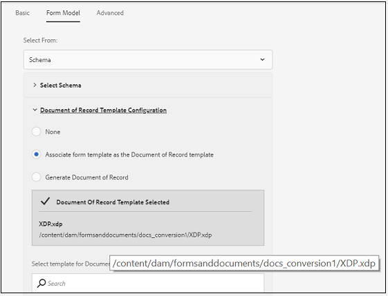

# 啟用最適化表單生成記錄文件的建議工作流程 {#recommended-workflows-dor-generation}

記錄文檔(DoR)使您能夠保留您提供的資訊的記錄，並以最適化的形式提交，以便以後可以參考它。
DoR使用基本模板來定義其佈局。 您可以使用預設範本或將任何其他範本與適用性表單建立關聯，以產生DoR。

有關生成DoR的詳細資訊，請參閱[為最適化表單生成記錄文檔](https://helpx.adobe.com/experience-manager/6-5/forms/using/generate-document-of-record-for-non-xfa-based-adaptive-forms.html)。

[Automated forms conversion服務](../help/introduction.md)將下列來源表單轉換為最適化表單：

* 非互動式PDF forms
* 阿克羅Forms
* XFA型PDF forms

您可以根據用於轉換的來源表單，使用以下方式產生DoR:

* 預設範本
* 源表單作為模板 — 如果選擇此選項，則轉換服務會自動將源表單與已轉換的最適化表單建立關聯，作為DoR模板。
* 將任何其他範本與已轉換的最適化表單建立關聯

下表說明了您使用的DoR模板如何影響生成DoR的佈局的示例：

<table> 
 <tbody>
 <tr>
  <td>
<strong>源表單</strong>
</td>
  <td>
<strong>生成的DoR</strong>
</td> 
   </tr>
  <tr>
   <td></td>
   <td>
如果使用預設模板生成DoR: </td>
   </tr>
   <tr>
   <td></td>
   <td>
如果使用源表單作為模板來生成DoR: 
</td>
   </tr>
  </tbody>
</table>

如表所示，如果使用源表單作為模板，則DoR將保留源表單的佈局。
本文說明根據三種來源表單類型產生DoR的建議路徑。

<table> 
 <tbody> 
  <tr> 
   <th><strong>源表單</strong></th> 
   <th><strong>生成DoR的方法</strong></th> 
  </tr> 
  <tr> 
   <td>
非互動式PDF forms
</td> 
   <td> 
    <ul> 
     <li><a href="#generate-document-of-record-using-cloud-configuration">在最適化表單轉換前啟用DoR生成，以使用預設模板生成DoR</a></li> 
     <li><a href="#edit-adaptive-form-properties-generate-document-of-record">在最適化表單轉換後編輯最適化表單屬性，以啟用使用預設或任何其他表單範本產生DoR</a></li> 
    </ul> </td> 
  </tr>
  <tr> 
   <td>
Acro Forms或XFA型PDF forms
</td> 
   <td> 
    <ul> 
     <li><a href="#use-input-form-as-template-to-generate-document-of-record">在最適化表單轉換前啟用DoR生成，以使用源表單作為模板生成DoR</a></li> 
     <li><a href="#edit-adaptive-form-properties-to-generate-document-of-record">在最適化表單轉換後編輯最適化表單屬性，以啟用使用預設範本、以來源表單作為範本或任何其他表單範本產生DoR的功能</a></li> 
    </ul> </td> 
  </tr>    
 </tbody> 
</table>

## 生成非交互PDF forms的記錄文檔{#generate-document-of-record-non-interactive-pdf}

如果您使用非互動式PDF表單作為Automated forms conversion服務的來源表單，您可以：

* 在最適化表單轉換前啟用DoR生成，以使用預設模板生成DoR
* 或在最適化表單轉換後編輯最適化表單屬性，以啟用使用預設或其他表單範本產生DoR

### 在轉換前啟用DoR生成以使用預設模板{#generate-document-of-record-using-cloud-configuration}生成DoR

1. 選擇&#x200B;**[!UICONTROL Tools]** > **[!UICONTROL Cloud Services]** > **[!UICONTROL Automated Forms Conversion Configuration]** >用於轉換的雲配置屬性> **[!UICONTROL Advanced]** > **[!UICONTROL Generate Document of Record]**&#x200B;選項。

   

1. 點選&#x200B;**[!UICONTROL Save & Close]**&#x200B;以儲存設定。

1. [執行轉換](../help/convert-existing-forms-to-adaptive-forms.md)。請務必使用在這些指示步驟1中編輯的雲端設定。
提交轉換的最適化表單時，系統會使用預設範本自動產生DoR。

### 在轉換後編輯最適化表單屬性以啟用DoR層代{#edit-adaptive-form-properties-generate-document-of-record}

如果在將來源表單轉換為最適化表單之前未啟用DoR產生，轉換後仍可啟用。

1. [在非互](../help/convert-existing-forms-to-adaptive-forms.md) 動式PDF表單上執行轉換，產生最適化表單。

1. 在&#x200B;**[!UICONTROL output]**&#x200B;資料夾中選取最適化表單，然後點選&#x200B;**[!UICONTROL Properties]**。

1. 在&#x200B;**[!UICONTROL Form Model]**&#x200B;標籤中，展開&#x200B;**[!UICONTROL Document of Record Template Configuration]**&#x200B;區段並選取&#x200B;**[!UICONTROL Generate Document of Record]**。

   

1. 點選&#x200B;**[!UICONTROL Save & Close]**&#x200B;以儲存設定。

提交轉換的最適化表單時，系統會使用預設範本自動產生DoR。 如果要將任何其他DoR模板與轉換的最適化表單關聯，可以選擇&#x200B;**[!UICONTROL Associate form template as the Document of Record template]**&#x200B;選項。

## 為Acro Forms或基於XFA的PDF forms生成記錄文檔{#generate-document-of-record-acroform-xfaform}

如果您使用Acro表單或XFA型PDF表單作為Automated forms conversion服務的來源表單，您可以：

* 在最適化表單轉換前啟用DoR生成，以使用源表單作為模板生成DoR

* 或在最適化表單轉換後編輯最適化表單屬性，以啟用使用預設範本、以來源表單作為範本或任何其他表單範本產生DoR的功能

### 在轉換前啟用DoR生成以使用源表單模板{#use-input-form-as-template-to-generate-document-of-record}生成DoR

1. 選擇&#x200B;**[!UICONTROL Tools]** > **[!UICONTROL Cloud Services]** > **[!UICONTROL Automated Forms Conversion Configuration]** >用於轉換的雲配置屬性> **[!UICONTROL Advanced]** > **[!UICONTROL Generate Document of Record]**&#x200B;選項。

1. 點選&#x200B;**[!UICONTROL Save & Close]**&#x200B;以儲存設定。

1. [執行轉換](../help/convert-existing-forms-to-adaptive-forms.md)。請務必使用在這些指示步驟1中編輯的雲端設定。
轉換服務會自動將Acro表單或XFA型PDF表單與轉換的最適化表單建立關聯，作為DoR範本。
您可以開啟最適化表單屬性，以在**[!UICONTROL Form Model]**&#x200B;標籤的&#x200B;**[!UICONTROL Document of Record Template Configuration]**&#x200B;區段中檢視DoR範本。

   

   提交轉換的最適化表單時，系統會使用來源表單範本自動產生DoR。

### 在轉換後編輯最適化表單屬性以啟用DoR層代{#edit-adaptive-form-properties-to-generate-document-of-record}

1. [在非互](../help/convert-existing-forms-to-adaptive-forms.md) 動式PDF表單上執行轉換，產生最適化表單。

1. 在&#x200B;**[!UICONTROL output]**&#x200B;資料夾中選取最適化表單，然後點選&#x200B;**[!UICONTROL Properties]**。

1. 在&#x200B;**[!UICONTROL Form Model]**&#x200B;頁簽中，展開&#x200B;**[!UICONTROL Document of Record Template Configuration]**&#x200B;部分並選擇&#x200B;**[!UICONTROL Generate Document of Record]**以使用預設模板啟用DoR生成。
您也可以選擇**[!UICONTROL Associate form template as the Document of Record template]**&#x200B;選項並選擇模板以啟用使用源表單模板或任何其他表單模板生成DoR。

1. 點選&#x200B;**[!UICONTROL Save & Close]**&#x200B;以儲存設定。
