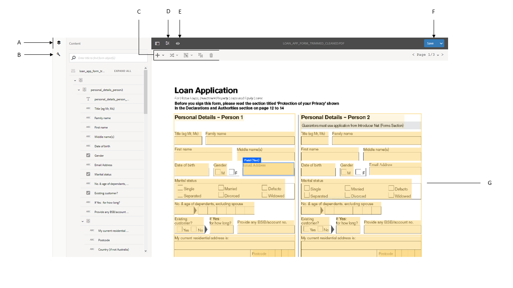

# 審閱並更正轉換的表單{#review-and-correct-converted-forms}

AEM Forms Automated Forms Conversion服務可識別輸入PDF檔案的欄位、內容和版面配置，並將PDF檔案轉換為最適化表單。 輸出自適應表單可能缺少一些欄位或未正確轉換的欄位。 您可以使用「檢閱與修正」編輯器來改進已識別的欄位，並重新產生最適化表單，讓輸出更接近所需的體驗。 第一次轉換後，您可以在編輯器中開啟輸入的PDF檔案，以：

* 檢視轉換期間識別的所有欄位和內容
* 識別轉換期間遺漏的欄位和內容
* 驗證欄位的類型並更改其類型（如果需要）
* 驗證已識別的表格、調整欄大小並修改儲存格內容
* 移除錯誤識別的欄位

進行必要的變更後，將PDF表格重新傳送至轉換服務。 成功轉換時，更新的資產（包括最適化表單和架構）會下載到您的AEM Forms例項。 您可以重複此程式，直到達到所需的體驗。 

您需要Google Chrome、Mozilla FireFox或Microsoft edge瀏覽器才能使用審閱和正確的編輯器。 編輯器不支援Internet Explorer。

## 歡迎使用「檢閱與修正」編輯器 {#welcome-to-review-and-correct-editor}

「檢閱與修正」編輯器提供簡單易用的介面。 它具有以下元件：

* 內容瀏覽器：您可以使用內容瀏覽器來變更元素的位置。 內容瀏覽器可讓您拖放表單物件以變更其位置。 例如，在文本框之前移動表。 它相應地更改了輸出自適應表單的制表符順序。
* 屬性瀏覽器：它顯示選定欄位的屬性。 您也可以修改屬性。
* 工具列：工具列位於編輯器的頂部。 它顯示用於添加、修改、分組、取消分組和刪除欄位的工具。
* 開啟屬性：點選圖示時會顯示「開啟屬性」  選項。 您可以按一下開啟屬性以開啟表單屬性並檢視其他選項。
* 篩選按鈕：篩選按鈕  位於編輯器的頂端。 它可讓您篩選欄位，只顯示文字、欄位、選擇群組、面板或所有元件。
* 「保存」按鈕：按 **[!UICONTROL Save]** 鈕位於編輯器的右上角。 您也可以使用「儲存」按鈕旁的箭頭來檢視傳送表格進行轉換的選項。

* PDF表格：編輯器會顯示來源PDF檔案，並以已識別欄位覆蓋它。 您可以使用工具列中的工具來修改欄位。
* 頁面：來源表單可以有多個頁面。 編輯器在右上角提供按鈕，以在頁面之間導覽。

**************答：內容瀏覽**&#x200B;器B.屬性瀏 **覽器C.** 工 **具列D.屬性按鈕** E.篩選按鈕 **F.儲存按鈕** G。已識別欄位的PDF表格已覆蓋

第一次成功轉換後，轉換服務會覆蓋原始PDF檔案及已識別的欄位和元件。 這些欄位或元件類型如下：文字、欄位、面板、選擇群組和表格：

* 文字：原始PDF檔案中的純文字。 例如，上方顯示的影像中的「貸款申請」文字。
* 欄位：與值或輸入框關聯的文本或表徵圖標籤的組合。 例如，上圖中的第一個欄位名稱。 它有文字標籤和輸入方塊。 欄位支援文字、數值、下拉式清單、日期、電子郵件、電話號碼、簽名、貨幣和密碼資料類型。
* 面板：內容與元件的邏輯集合。 例如，上圖中「人員1」和「人員2」面板的「個人詳細資料」。
* 選擇群組：與多種選擇選項相關的文字組合：複選框和單選按鈕。 例如，上述影像中的「婚姻狀態」和「現有客戶」。\
   轉換服務根據選擇群組標題及其多重選擇選項，自動將選擇群組轉換為單一選擇選項按鈕或多選核取方塊。 例如，如果有「選擇任何選項 **」作為選擇群組標題，或多選項允許您僅選擇一個選項(** Yes **或** No ****)，則轉換服務會自動將選擇群組轉換為單選選項按鈕。 同樣地，如果有「選擇所有套用項目 **」或「選擇多個項目****** 」作為選擇群組標題，或者多選項允許您選擇多個選項，則轉換服務會自動將選擇群組轉換為多選項核取方塊。

* 表格：2-d表，其資訊以列和行表示。 可以向表添加或刪除行或列。

## 開始檢視轉換 {#start-reviewing-a-conversion}

第一次成功轉換後，轉換服務會覆蓋原始PDF檔案及已識別的欄位和元件。 您可以對已識別的欄位進行改良，並重新產生最適化表單，讓輸出更接近所需的體驗。 您只有在第一次成功轉換後，才能開始檢視轉換。

### 開始之前 {#before-you-start}

* 「檢閱與更正」編輯器不支援片段。 切勿使用編輯器來檢視在轉換期間啟用「擷 **取片段** 」選項的轉換。 您可以使用最適 [化表單編輯器](https://helpx.adobe.com/experience-manager/6-5/forms/using/introduction-forms-authoring.html) ，進行此類轉換。

* 「檢閱與正確」編輯器沒有復原動作。 僅使用「保存」按鈕永久保存更改。

### 開始審核 {#start-the-review}

若要開始審核轉換，請選取用於轉換的來源PDF檔案，然後選取並點選「審核轉 **換」**。 「檢閱與更正」編輯器會在新標籤中開啟。 您可以開始檢視轉換。 開始修復任何其他問題之前，請執行下列基本檢查：

1. **檢查所有欄位的類型**:轉換服務可能會為欄位指派錯誤類型。 例如，將文字指派給行動電話欄位，而非文字電話。 您可以將滑鼠暫留在欄位上，以尋找欄位類型。

   若要變更欄位類型，請選取欄位、開啟屬性瀏覽器、從下拉式清單中選 **[!UICONTROL Type]** 取值，然後點選 **[!UICONTROL Save]**。 類型已更改。

   

1. **移除額外的面板**:轉換服務可產生額外的面板。 例如，父面板中包含額外的子面板，空白空間轉換為面板，核取方塊轉換為面板。 檢視所有面板的邊界，並移除額外的面板。 您可以使用篩選按鈕  或內容瀏覽器來檢視所有面板。

   您可以刪除或取消群組面板以將其移除。 使用刪除選項時，面板的子欄位或元件也將被刪除：

   * 若要刪除面板，請選取面板，然後點選工具列  中的刪除圖示。 在確認對話方塊上，點選 **[!UICONTROL Confirm]**。 點選 **[!UICONTROL Save]** 以儲存變更。

   * 若要取消面板群組，請選取面板，然後點選工具列中的取消群組圖示。 此面板為未分組的面板，未分組面板的子欄位將調整為父欄位。 點選**[!UICONTROL Save]**以儲存變更。

1. **建立文本的邏輯組**:驗證所識別的文字是否完整及正確。 此外，文字會邏輯地放置在正確的面板或群組中。 例如，在多欄版面中，一個邏輯群組的文字會放置在另一個群組中。

   * 若要檢視文字的完整性和正確性，請使用篩選  按鈕來僅檢視文字、按一下每個文字並驗證。 修正拼字、錯字或語法問題（如果有）。

   * 若要新增文字至表單，請點選+按鈕，點選 **[!UICONTROL Text]**。 繪製方塊、開啟屬性瀏覽器，然後輸入要新增至「內容」方塊的文字。

1. **** 查看表：確保標識表的所有邊框。 此外，請確定儲存格的內容已正確識別。

   * 若要識別遺漏的邊界，請使 **[!UICONTROL Add Column]** 用或 **[!UICONTROL Add Row]** 選項。

   * 若要移除額外的邊界，請使 **[!UICONTROL Delete Column]** 用或 **[!UICONTROL Delete Row]** 選項。

進行必要的變更後，點選按 **[!UICONTROL Save & Convert]** 鈕以重新傳送PDF表格至轉換服務。 每個欄位被轉換為相應的自適應欄位分量。 轉換後，更新的資產（包括最適化表單和架構）會下載到您的AEM Forms例項。 視表單的複雜性而定，服務可能需要一些時間才能完成轉換。

執行基本檢查後，您可以檢閱表單以修正您組織的特定問題。 這些問題可能與新增遺失欄位等有關。 您可以檢視「使 [用檢閱和更正編輯器工具](review-correct-ui-edited.md#use-the-review-and-correct-editor-tools) 」區段，以瞭解編輯器提供的所有工具，以修正此類問題。

您也可以辨識幾乎所有表單中都發生的相同問題，並向Adobe報告這些模式。 使用「檢閱與修正」編輯器，直到達到所需的體驗。

## 使用「檢閱與修正」編輯器工具 {#use-the-review-and-correct-editor-tools}

使用「檢閱」和「正確」編輯器，您可以：

* [新增元件至表單](review-correct-ui-edited.md#add-a-component-to-the-form)
* [添加或編輯表](review-correct-ui-edited.md)
* [變更元件類型](review-correct-ui-edited.md#change-type-a-component)

* [建立或移除面板](review-correct-ui-edited.md#create-or-remove-a-panel)
* [刪除面板或元件](review-correct-ui-edited.md#delete-a-panel-or-component)
* [設定元件的屬性](review-correct-ui-edited.md#set-properties-of-a-component)
* [傳送表格以進行轉換](review-correct-ui-edited.md#send-a-form-for-conversion)

### 新增元件至表單 {#add-a-component-to-the-form}

轉換服務可能無法識別列印表單的某些元件。 例如，在轉換 **期間，表單的出生日期** (Date of bird)元件不會被識別。 您可使用+工 **具** ，協助識別此類元件。 此工具可讓您新增文字、欄位、選擇群組、表格和面板元件。

若要新增元件至表單，請點選 **[!UICONTROL +]** 並點選 **[!UICONTROL Field]**。 繪製欄位的框覆蓋標籤和輸入框。 例如，上述範例影像使用欄位元件，將其下方的 **Date of Birth** 標籤和值方塊新增至表單。 當您繪製方塊時，轉換服務會識別欄位的類型。 如有需要，您可以從屬性瀏覽器變更欄位類型。 建立元件後，開啟屬性瀏覽器並設定元件的屬性。

點選 **[!UICONTROL Save]** 按鈕以儲存修改，或使用按 **[!UICONTROL Save & Convert]** 鈕將PDF表格重新傳送至轉換服務。

### 添加或編輯表 {#addedittable}

轉換可讓一些儲存格、邊界或表格儲存格的內容無法識別。 例如，表的一行未標識。 您可以使用「檢閱與更正」編輯器來識別此類項目。 可對表執行以下操作：

* 要選擇表，請按一下表的任何單元格。
* 要修改單元格的屬性，例如，名稱、標題或類型，請按兩下單元格。 您也可以連按兩下儲存格來修改內容、標示必要欄位，並選取其他屬性。
* 若要在表單中新增／識別完全未識別或新的表格，請使用工 **[!UICONTROL +]** 具。
* 要調整表的單元格或行的大小，請按一下表的空區域，將滑鼠移到行或列邊界上，當游標指針改變時，選擇並移動邊界。 調整大小後，按一 **[!UICONTROL Done]** 下以提交變更。 您可以按鍵 **[!UICONTROL ESC]** 放棄調整大小。

* 要添加或刪除行或列，請選擇表行中的單元格，然後從菜單中 **[!UICONTROL Add Row]**&#x200B;選 **[!UICONTROL Add Column]**&#x200B;擇、 **[!UICONTROL Delete Row]**&#x200B;或選 **[!UICONTROL Delete Column]** 項。

* 要拆分表格的單元格，請從菜單 **[!UICONTROL Spilt Vertical]** 中選 **[!UICONTROL Split Horizontal]** 擇或  選項。

* 要合併表的單元格，請選擇要合併的單元格，然後從表菜單 **[!UICONTROL Merge Cells]** 中選擇  選項。

### 變更元件類型 {#change-type-a-component}

轉換服務可以建立某些類型不正確的欄位。 例如，在下圖中，「性別 **」欄位** ，會錯誤地識別為「 **文字** 」欄位。 此外，標籤的內容不正確。 欄位應為選擇欄位類型，標籤應為「性別」。 要更改元件類型並更正其標籤，請執行以下操作：

選取要轉換的欄位、點選  及點選欄位類型。 欄位會轉換為選取的欄位類型。 欄位只能轉換為下表中列出的類型。 面板元件只能取消分組，不能進行轉換。

| **元件** | **轉換為** |
|---|---|
| 文字 | 欄位或選擇群組 |
| 欄位 | 文字或選擇群組 |
| Choice Group | 文字或面板 |

轉換後，請開啟屬性瀏覽器、指定標籤，並指定其他必要屬性。 點選 **[!UICONTROL Save]** 按鈕以儲存修改，或使用「儲存並轉換」按鈕將PDF表格重新傳送至轉換服務。

### 建立或移除面板 {#create-or-remove-a-panel}

轉換服務將打印表單的相關元件和內容聚合到面板。 例如，表單可以有位址面板，其中包含欄位，例如，名稱、出圖號、區域、城市、州、郵遞區號和國家。 這些欄位會分組在面板中。 表單可以有多個面板。

轉換服務可建立具有與其他元件無關的元件的面板，或將相對元件離開面板。 您可以使用群組或取消群組工具來修正這些面板：

* 若要移除面板，請選取面板，然後點選「取消群組 。 面板將被移除，面板的子元件將移至父元件。 您也可以使用刪 [除元件選項](review-correct-ui-edited.md#delete-a-panel-or-component) ，刪除面板及其子項。

* 若要建立面板，請使用Ctrl鍵（在Windows或Linux上）或Control鍵（在Mac上）來選取相關元件，並點選  ，以建立面板。 開啟屬性瀏覽器以指定面板的屬性。

點選 **[!UICONTROL Save]** 按鈕以儲存修改，或使用按 **[!UICONTROL Save & Convert]** 鈕將PDF表格重新傳送至轉換服務。

### 刪除面板或元件 {#delete-a-panel-or-component}

轉換服務可識別某些不正確的面板或元件。 這些面板的大部分元件是無關的。 您可以刪除這些面板或元件。

若要刪除面板或元件，請選取面板或元件，然後點選刪除圖  示。 在確認對話方塊上點選 **[!UICONTROL Confirm]**。 將刪除選定的面板或元件。 刪除面板時，面板的所有子項也將被刪除。 您可以使用Ctrl鍵（在Windows或Linux上）或Control鍵（在Mac上）來選取多個元件或面板。

### 設定元件的屬性 {#set-properties-of-a-component}

表單的每個元件都有一組屬性，例如名稱、標題、類型。 若要設定元件的屬性，請選取元件，然後點選屬性瀏覽器。 將顯示所選元件的屬性。 變更或設定屬性。

點選 **[!UICONTROL Save]** 按鈕以儲存修改，或使用按 **[!UICONTROL Save & Convert]** 鈕將PDF表格重新傳送至轉換服務。

### 傳送表格以進行轉換 {#send-a-form-for-conversion}

在「檢閱」和「更正」編輯器中進行所有必要變更後，您可以重新傳送表格以進行轉換。 若要傳送表格以進行轉換，請點選 **[!UICONTROL Save & Convert]**。 此 **[!UICONTROL Sent for conversion label]** 程式碼會套用至包含來源檔案的資料夾，而更新的來源表單會上傳至Adobe I/O上執行的轉換服務。

視表單的複雜性而定，轉換服務轉換表單可能需要一些時間。 轉換完成後，轉換的最適化表單和相關資產會下載到您的機器。 轉換完成後，您可以在編輯器中檢視表單，並視需要在最適化表單編輯器中開 [啟最適化表單](https://helpx.adobe.com/experience-manager/6-5/forms/using/introduction-forms-authoring.html) ，以取得最終的修正集。

如果您在最適化表單編輯器中更新表單後重新傳送表單以進行轉換，所有在最適化表單中所做的變更都會遺失。 您只有在成功轉換後，才可以在審核中開啟表單並修正編輯器。

<!--
Comment Type: draft

<h3>Open adaptive forms editor</h3>
-->

<!--
Comment Type: draft

There can be instances where you require adaptive forms editor to make the changes like, applying a different theme to the form or fixing tables. Once you have made all the required changes in Review and Correct editor and converted the form, you can open your form in adaptive forms editor to make the final set of changes.

To open the form with adaptive forms editor, tap the  icon, and tap <strong>Open Adaptive Form Editor</strong>. The form opens in adaptive form editor. 

## Previous {#previous}

[Use Automated Forms Conversion service](convert-existing-forms-to-adaptive-forms.md)
