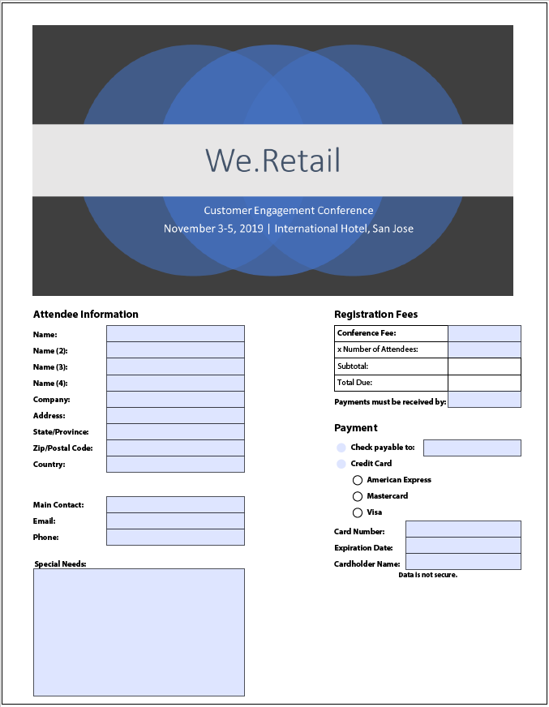

# 最佳實務和已知的複雜模式 {#Best-practices-and-considerations2}

本檔案提供的准則和建議，可供使用[!DNL Automated Forms Conversion service]時的表單管理員、作者和開發人員受益。 文章探討從準備來源表單到修正複雜模式（需要額外努力才能自動轉換）等最佳實務。 這些最佳做法對[!DNL Automated Forms Conversion service]的整體效能和產出有共同的貢獻。

## 最佳實務

轉換服務會將AEM [!DNL Forms]例項上可用的PDF forms轉換為最適化表單。 下列最佳實務可協助您改善轉換速度和準確度。 此外，這些最佳實務可協助您節省轉換活動後所花時間。

### 上傳來源之前

您可以視需要一次或分階段上傳所有PDF forms。 在上傳表單前，請參閱以下提醒：

* 將資料夾中的表單數量保持在15份以下，並將資料夾中的總頁數保持在50份以下。
* 將資料夾的大小保持在10 MB以下。 不要將表單放在子資料夾中。 
* 表單的頁數應保持在15頁以下。
* 將源文檔整理為一組8-15個文檔。 將來源表單與通用的最適化表單片段保留在單一批次中。
* 請勿上傳受保護的表單。 此服務不會轉換受密碼保護和安全的表單。
* 請勿上傳[PDFPortfolio](https://helpx.adobe.com/acrobat/using/overview-pdf-portfolios.html)。 此服務不會將PDFPortfolio轉換為最適化表單。
* 請勿上傳檔案名稱中含有空格的來源表單。 先從檔案名稱中移除空格，再上傳表單。
* 請勿上傳掃描、填入和表單，使用英文、法文、德文和西班牙文以外的任何語言。 此服務不支援這些表單。

使用XDP表單進行轉換時，請先執行下列步驟，再上傳來源XPD表單：

* 分析XDP表單並修正視覺問題。 確保源文檔使用預期的控制項和結構。 例如，源表單可以具有用於單個選擇的複選框，而不是單選按鈕。 將核取方塊變更為選項按鈕，以產生具有預期元件的最適化表單。
* [開始轉換之前，將系](http://www.adobe.com/go/learn_aemforms_designer_65) 結新增至XDP格式。當源XDP表單中有綁定可用時，服務會在轉換期間自動將綁定應用到相應的最適化表單欄位。 它可節省手動應用綁定所需的時間。
* [將Adobe Sign](https://helpx.adobe.com/sign/using/text-tag.html) 標籤新增至XDP檔案。服務會自動將Adobe Sign標籤轉換為對應的最適化表單欄位。 適用性Forms支援有限數量的Adobe Sign欄位。 如需完整的支援欄位清單，請參閱在最適化表單中使用Adobe Sign](https://experienceleague.adobe.com/docs/experience-manager-65/forms/adaptive-forms-advanced-authoring/working-with-adobe-sign.html?lang=en)檔案。[
* 盡可能將XDP文檔中的複雜表轉換為簡單表。 表格包含表格單元格中的表單欄位、大小不均的單元格、行或列跨越的單元格、合併的單元格、部分邊框或沒有可見邊框的表格被視為一個複雜表格。 具有上述任何一個項的表被視為複雜表。
<!-- * Use sub-forms in XDP documents to create panels in adaptive forms. Service converts each sub-form to one or more adaptive form panels during conversion. -->

### 開始轉換之前

* 建立最適化表單範本。 範本有助於為組織或部門的表單指定統一的結構。
* 在最適化表單範本中指定頁首和頁尾。 此服務會忽略源文檔的頁首 — 頁尾，並使用在適用性表單模板中指定的頁首 — 頁尾。
* 建立最適化表單主題。 主題有助於為您的組織或部門的形式提供統一的外觀和風格。
* 設定表單資料模型以儲存和擷取資料來源。 建立並配置表單資料模型的讀寫服務。
* 建立最適化表單片段並設定服務以使用最適化表單片段。
* 為需要業務流程自動化的表單準備常用的工作流模型。
* 視需要設定Adobe Analytics

## 了解複雜的模式

AEM [!DNL Forms Automated Conversion service]使用人工智慧和機器學習演算法來了解來源表單的版面配置和欄位。 每個機器學習服務會持續從來源資料中學習，並透過每次流失產生改良的輸出。 這些服務從人類經驗中學習。

[!DNL Automated Forms Conversion service] 接受大量形式的訓練。它可輕鬆識別來源表單中的欄位，並產生最適化表單。 然而，PDF forms中有些領域和風格很容易被人眼看到，但是卻難以理解。 服務可指派不同於適用欄位類型或面板給某些欄位或樣式。 下面列出了所有此類欄位和樣式模式。

隨著服務不斷從來源資料中學習，服務會開始識別並指派正確的欄位或面板給這些模式。 目前，您可以使用[檢閱和修正](review-correct-ui-edited.md)編輯器來修正此類問題。 開始修正問題或進一步閱讀前，請熟悉[最適化表單元件](https://helpx.adobe.com/experience-manager/6-5/forms/using/introduction-forms-authoring.html)。

### 一般模式 {#general}

| 圖樣 | 範例 |
|--- |--- |
| ****  PatternService不會將填入的PDF forms轉換為最適化表單。  ****  解析度使用空的最適化表單。 |  |
| ****  PatternService無法識別密集表單中的文字和欄位。  ****   解決方法開始轉換前，增加密集表單的文字和欄位之間的寬度。 |  |
| ****  PatternService不支援掃描的表單。  ****  解決方法請勿使用掃描的表單。 |  |
| ****  PatternService不會擷取影像內的影像和文字。  ****   解析度手動將影像或文字新增至轉換的表單。 |  |
| ****  具有點狀或非清除邊界和邊界的陣清單不會轉換。  ****  解決方法使用邊界和邊界明確的表。支援。 |  |
| ****   模式適用性表單不支援立即可用的垂直文字。因此，服務不會將垂直文字轉換為對應的適用性Forms文字。   ****   解決方法視需要使用最適化表單編輯器來新增垂直文字。 |  |

### 選擇組  {#choice-group}

| 圖樣 | 解析度 |
|--- |--- |
| ****   具有方框或圓以外形狀的PatternChoice組選項不會轉換為相應的最適化表單元件。  ****   解析度將選項形狀更改為框或圓形，或使用審閱和更正編輯器來標識形狀。 |  |

### 表單欄位 {#form-fields}

| 圖樣 | 解析度 |
|--- |--- |
| ****   PatternService不會識別沒有清除邊界的欄位。  ****   解決方法使用審閱和更正編輯器來標識此類欄位。 |  |
| ****   PatternService可能無法識別表單底部或右側有註解的選擇性群組表單欄位。  ****   解決方法使用審閱和更正編輯器來標識此類欄位 |  |
| ****   PatternService會合併或指定錯誤類型給彼此非常靠近或沒有明確邊界的某些表單欄位。  ****   解決方法使用審閱和更正編輯器來標識此類欄位。 |  |
| ****   PatternService無法識別字幕遠處的欄位，或字幕和輸入欄位之間的虛線。  ****   解決方法使用邊界明確的表單欄位，或使用檢閱和修正編輯器來修正此類問題。 |  |

### 清單 {#lists}

| 圖樣 | 解析度 |
|--- |--- |
| ****  包含表單欄位的模式清單會合併或不轉換為對應的最適化表單元件解決方法使用邊界   ****  明確的表單欄位，或使用檢閱和修正編輯器來修正這類問題。 |  |
| ****  PatternService可讓一些巢狀清單保留未識別的解決方   ****   法使用檢閱和修正編輯器來修正此類問題。 |  |
| ****   PatternService會合併一些包含選擇組的清單，這些清單可   ****   以使用Resolution Use Review和Correct Editor來修復這些問題。 |  |

<!--
Comment Type: draft

<h3>Choice groups</h3>
-->

<!--
Comment Type: draft

<ul>
<li>Lists with form fields, nested lists, and nested choice groups are not supported.</li>
<li>Form fields with captions at bottom or right are not supported.</li>
<li>Form fields without borders are not supported.</li>
<li>Hidden form fields are not supported.</li>
<li>Button in PDF forms are not converted to adaptive form buttons.  </li>
<li>Tables with clear explicit boundaries and borders are supported.</li>
<li>Fields with far away captions are not supported.  </li>
<li>Choice groups with only box or circle shaped selectors are supported. </li>
</ul>
-->
