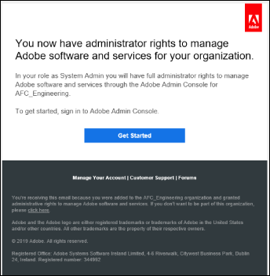
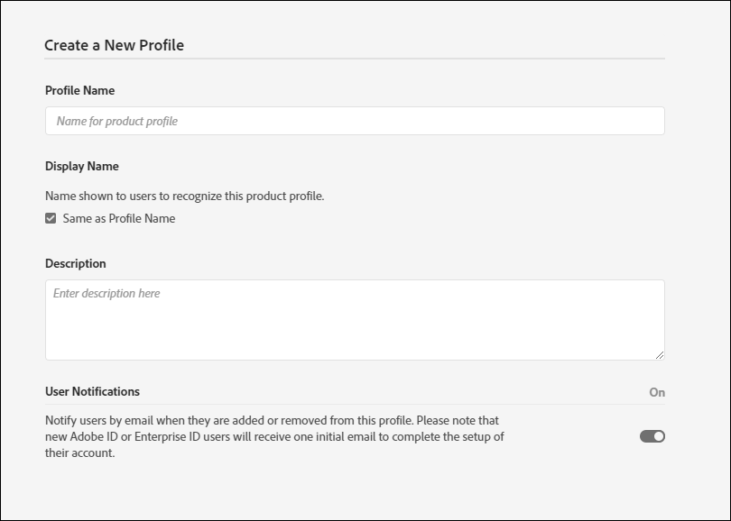
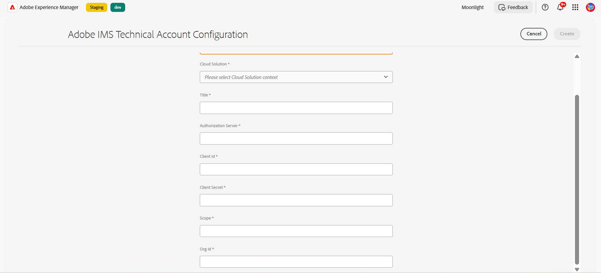

# 配置Automated forms conversion服務(AFCS) {#about-this-help}

本文介紹管理AEM員如何配置Automated forms conversion服務(AFCS)，以自動將其PDF forms轉換到Adaptive Nigus。 本文針對您組織的AEMIT和管理員。 所提供的資訊假定任何閱讀本文的人都熟悉以下技術：

* 安裝、配置和管理Adobe Experience Manager和AEM包，

* 使用Linux®和Microsoft® Windows®作業系統，

* 配置SMTP郵件伺服器
======
<!--
>[!VIDEO](https://video.tv.adobe.com/v/29267/) 

**Watch the video or read the article to configure Automated Forms Conversion service (AFCS)**
-->

## 上線{#onboarding}

該服務可免費向6AEM.5Forms和6.5 LTSForms現AEM場定期客戶和Adobe管理服務企業客戶提供。 您可以聯繫Adobe銷售團隊或Adobe代表以請求訪問該服務。 該服務還面向AEM Formsas a Cloud Service客戶免費預啟用。

Adobe 為您的組織啟用存取權限，並向您指定的組織管理員提供所需的特權。 管理員可以授予組織的 AEM Forms 開發人員（使用者）存取權限以連接到該服務。

## 先決條件 {#prerequisites}

您需要以下人員才能使用Automated forms conversion服務(AFCS):

* Automated forms conversion服務(AFCS)已為您的組織啟用
* 具有轉換服務管理員權限的Adobe ID帳戶
* 具有最新AEMService Pack或最新更新的正在運AEM行的6.5、6.5 LTS或AEM Formsas a Cloud Service作者實AEM例。
* 屬於AEMforms-user組AEM的用戶（在實例上）

## 設定環境 {#setuptheservice}

使用服務之前，請準AEM備您的作者實例以連接到在Adobe雲上運行的服務。 按列出的順序執行以下步驟，為服務準備實例：


1. [下載並安裝AEM6.5或AEM6.5 LTS，或板載AEM Formsas a Cloud Service](#aemquickstart)
1. (AEM僅適用於6.5AEM和6.5 LTS) [下載並安裝最新AEM的Service Pack](#servicepack)
1. (AEM僅適用於6.5AEM和6.5 LTS) [下載並安裝最新的AEM Forms附加程式包](#downloadaemformsaddon)
1. （可選）[下載並安裝最新的連接器包](#installConnectorPackage)
1. [建立自定義主題和模板(AEM6.5 / 6.5 LTS)或使用預設值(Cloud Service)](#referencepackage)

### 下載並安裝AEM6.5或AEM6.5 LTS或板載AEM Formsas a Cloud Service {#aemquickstart}


Automated forms conversion服務(AFCS)在作者實AEM例上運行。 您需AEM要6.5、AEM6.5 LTS或AEM Formsas a Cloud Service來設AEM置作者實例。

* 如果您沒有AEM6.5或AEM6.5 LTS啟動和運行，請從以下位置下載。 下載完AEM後，有關設定作者實例AEM的說明，請參閱[部署和維護](https://helpx.adobe.com/tw/experience-manager/6-5/sites/deploying/using/deploy.html#defaultlocalinstall)。

   * 如果您是現有AEM客戶，請AEM從[Adobe許可網站](http://licensing.adobe.com)下載6.5或AEM6.5 LTS。

   * 如果您是Adobe合作夥伴，請使用[Adobe合作夥伴培訓計畫](https://adobe.allegiancetech.com/cgi-bin/qwebcorporate.dll?idx=82357Q)AEM請求6.5或AEM6.5 LTS。

* 如果您使用AEM Formsas a Cloud Service，請參閱板載到[AEM Formsas a Cloud Service](https://experienceleague.adobe.com/docs/experience-manager-forms-cloud-service/forms/setup-environment/setup-forms-cloud-service.html?lang=zh-Hant#setup-environment)和[設定本地開發環境](https://experienceleague.adobe.com/docs/experience-manager-forms-cloud-service/forms/setup-environment/setup-local-development-environment.html?lang=zh-Hant#setup-environment)。


### (AEM僅適用於6.5AEM和6.5 LTS)下載並安裝最新AEM的Service Pack {#servicepack}

下載並安裝最新AEM的Service Pack。 有關詳細說明，請參AEM閱[6.5 Service Pack發行說明](https://helpx.adobe.com/tw/experience-manager/6-5/release-notes/sp-release-notes.html)。

### (AEM僅適用於6.5AEM和6.5 LTS)下載和安裝AEM Forms附加軟體包  {#downloadaemformsaddon}

實AEM例包含基本表單功能。 轉換服務需要AEM Forms的全部功能。 下載並安裝AEM Forms附加軟體包以利用AEM Forms的所有功能。 需要套件才能設定並執行轉換服務。 如需詳細指示，請參閱[安裝及設定資料擷取功能。](https://experienceleague.adobe.com/zh-hant/docs/experience-manager-65/content/forms/install-aem-forms/osgi-installation/installing-configuring-aem-forms-osgi)

>[!NOTE]
> 安裝附加套件後，請務必執行必要的安裝後組態。
>

<!--
### (Optional) Download and install connector package  {#installConnectorPackage}

The connector package provides early access to the [Auto-detect logical sections](convert-existing-forms-to-adaptive-forms.md#run-the-conversion) features and improvements delivered in release AFC-2020.03.1. Do not install the package if you do not require feature and improvements delivered in AFC-2020.03.1.  You can [download the connector package from AEM Package Share](https://www.adobeaemcloud.com/content/marketplace/marketplaceProxy.html?packagePath=/content/companies/public/adobe/packages/cq650/featurepack/AFCS-Connector-2020.03.1).
-->


### 建立自訂主題和範本 {#referencepackage}

**AEM Forms as a Cloud Service：**&#x200B;您可以使用現成的範本，或建立自訂範本，並將[服務組態](#configure-the-cloud-service)指向它們。

**（僅適用於AEM 6.5和AEM 6.5 LTS）**&#x200B;自動錶單轉換服務(AFCS)需要至少一個主題和一個範本，才能將PDF表單轉換為最適化表單。 若要使用以核心元件為基礎的範本和主題，您必須[啟用最適化表單核心元件](https://experienceleague.adobe.com/docs/experience-manager-65/forms/adaptive-forms-core-components/enable-adaptive-forms-core-components.html?lang=zh-Hant)；此處會記錄相關指示。 如果您在[生產模式](https://helpx.adobe.com/tw/experience-manager/6-5/sites/administering/using/production-ready.html) （nosamplecontent執行模式）下啟動AEM 6.5或AEM 6.5 LTS，則不會安裝參考套件。 建立您自己的自訂主題和範本，或在您的作者執行個體上下載並安裝[AEM Forms參考Assets](https://experience.adobe.com/#/downloads/content/software-distribution/en/aemcloud.html)套件以取得參考主題和範本。 然後指向[服務組態](#configure-the-cloud-service)，在使用服務之前使用範本和佈景主題。

## 設定存取權和許可權

在您繼續設定服務並連線您的執行個體與Adobe Cloud上執行的服務之前，請瞭解連線到服務所需的角色和許可權。 此服務使用兩種不同型別的角色：管理員和開發人員：

* **管理員**：管理員負責管理其組織的Adobe軟體與服務。 管理員可向組織內的開發人員授予存取權，以連線至在Adobe Cloud上執行的自動錶單轉換服務(AFCS)。 為組織布建管理員時，管理員會收到標題為&#x200B;**[!UICONTROL 'You now have administrator rights to manage Adobe software and services for your organization']**&#x200B;的電子郵件。 如果您是系統管理員，請檢查信箱中是否有先前提及標題的電子郵件，並繼續[授與組織開發人員的存取權](#adduseranddevs)。



* **開發人員**：開發人員將AEM Forms作者執行個體連線至在Adobe Cloud上執行的Automated Forms Conversion Service (AFCS)。 當管理員授予開發人員連線至自動錶單轉換服務(AFCS)的許可權時，會向開發人員傳送一封電子郵件（標題為「您現在擁有管理貴組織Adobe API整合的開發者存取權」）。 如果您是開發人員，請檢查信箱中是否有包含先前提及標題的電子郵件，然後繼續前往[將您本端的AEM執行個體連線至Adobe Cloud上的自動錶單轉換服務。](#connectafcadobeio)


### 授予組織開發人員存取權

在Adobe為您的組織啟用存取權並提供所需的許可權給管理員後，管理員可以登入Admin Console （下面的詳細說明）、建立設定檔，並將開發人員新增到設定檔。 開發人員可以將AEM Forms的例項連線至Adobe Cloud上的自動錶單轉換服務(AFCS)。

開發人員是您指定執行轉換服務的組織成員。 只有已新增至Adobe自動化表單轉換服務(AFCS)設定檔的開發人員，才有權使用自動化表單轉換服務(AFCS)。
執行以下步驟來建立設定檔並新增開發人員。 至少需要一個設定檔，才能將必要的存取權授予組織的開發人員：

1. 登入[Admin Console](https://adminconsole.adobe.com/)。 使用布建管理員的&#x200B;**Adobe ID**&#x200B;以使用自動錶單轉換服務(AFCS)登入。
1. 按一下&#x200B;**[!UICONTROL Automated Forms Conversion]**&#x200B;選項。
1. 在&#x200B;**[!UICONTROL Products]**&#x200B;索引標籤中按一下&#x200B;**[!UICONTROL New Profile]**。
1. 指定設定檔的&#x200B;**[!UICONTROL Name]**、**[!UICONTROL Display Name]**&#x200B;和&#x200B;**[!UICONTROL Description]**。 按一下 **[!UICONTROL Done]**。 例如，將設定檔建立為&#x200B;**AFC_Flamingo_Test_Dev**。

   

1. 將開發人員新增至設定檔。 若要新增開發人員：
   1. 在[Admin Console](https://adminconsole.adobe.com/enterprise)中，導覽至「概觀」標籤。
   1. 按一下所需產品卡上的&#x200B;**[!UICONTROL Assign Developers]**。
   1. 輸入開發人員電子郵件地址，以及名字和姓氏（可選）。
   1. 選取產品設定檔。 按一下&#x200B;**[!UICONTROL Save]**。

對所有使用者重複上述步驟。 如需新增開發人員的詳細資訊，請參閱[管理開發人員](https://helpx.adobe.com/tw/enterprise/using/manage-developers.html)。

管理員將開發人員新增到Adobe I/O設定檔後，開發人員會透過電子郵件（如果已設定）收到通知。

<!--
### Configure email notification for local AEM Forms instance

Automated Forms Conversion service (AFCS) uses the Day CQ mail service to send email notifications. These email notifications contain information about successful or failed conversions. If you choose not receive notification, skip these steps. Perform the following steps to configure the Day CQ Mail Service:

* For AEM 6.5 Forms or AEM 6.5 LTS Forms:

   1. Go to AEM configuration manager at `http://[server]:[port]/system/console/configMgr`
   2. Open the Day CQ Mail Service configuration. Specify a value for the **[!UICONTROL SMTP server host name]**, **[!UICONTROL SMTP server port]**, and **[!UICONTROL From address]** fields. Click **[!UICONTROL Save]**.

      You can contact your email service provider or IT administrator for information about host name and port of SMTP server. You can use any valid email address in the from field. For example, notification@example.com or donotreply@example.com.

   3. Open the **[!UICONTROL Day CQ Link Externalizer]** configuration. In the **[!UICONTROL Domains]** field, specify the actual host name or IP address and port number for local, author, and publish instances. Click **[!UICONTROL Save]**.

* For AEM Forms as a Cloud Service, [log a support ticket to enable the email service](https://experienceleague.adobe.com/docs/experience-manager-cloud-service/implementing/developing/development-guidelines.html?lang=zh-Hant#sending-email).
-->

### 新增使用者至表單 — 使用者群組 {#adduserstousergroup}

在指定用來執行服務的AEM使用者之設定檔中，指定電子郵件地址。 確定使用者是&#x200B;**forms-users**&#x200B;群組的成員。 會將電子郵件傳送至執行轉換之使用者的電子郵件地址。 若要指定使用者的電子郵件地址，並將使用者新增至表單使用者群組：

1. 以AEM管理員身分登入您的AEM Forms作者執行個體。 使用您的本機AEM憑證登入。
1. 按一下&#x200B;**[!UICONTROL Adobe Experience Manager]** > **[!UICONTROL Tools]** > **[!UICONTROL Security]** > **[!UICONTROL Users]**。
1. 選取指定要執行轉換服務的使用者，然後按一下&#x200B;**[!UICONTROL Properties]**。 **編輯使用者設定**&#x200B;頁面隨即開啟。
1. 在&#x200B;**[!UICONTROL Email]**&#x200B;欄位中指定電子郵件地址，然後按一下&#x200B;**[!UICONTROL Save]**。 成功完成或轉換失敗時，會將電子郵件傳送至指定的電子郵件地址。

   
1. 按一下「**群組**」標籤。 在[選取群組]索引標籤中，輸入並選取&#x200B;**表單 — 使用者**&#x200B;群組。
1. 按一下「**儲存並關閉**」。 使用者現在是forms-users群組的成員。

#### （僅適用於AEM 6.5和AEM 6.5 LTS）取得公開憑證 {#obtainpubliccertificates}


## 將您的AEM Forms執行個體連線至Adobe Cloud上的自動錶單轉換服務(AFCS)

管理員為您提供開發人員存取權後，您就可以將您的AEM Forms執行個體連線至Adobe Cloud上執行的自動錶單轉換服務(AFCS)。
執行以下步驟，將AEM Forms執行個體連線至自動錶單轉換服務：

[&#x200B;1. 在Adobe Developer Console上設定服務API](#configure-the-service-apis-on-adobe-developer-console)

[&#x200B;2. 建立Adobe IMS設定](#2-create-adobe-ims-configurations)

[&#x200B;3. 建立自動表單轉換設定](#3-create-automated-forms-conversion-configuration)

### &#x200B;1. 在Adobe Developer Console上設定服務API

若要使用自動錶單轉換服務(AFCS)，請建立專案，並將&#x200B;**自動Forms設定服務** API新增至Adobe Developer Console上的專案。 整合會產生API金鑰、使用者端密碼、技術帳戶ID、範圍與組織ID。
若要在Adobe Developer Console上設定自動錶單轉換服務API，請執行以下步驟：

1. 登入https://developer.adobe.com/console 。 使用您的管理員已布建以登入Adobe I/O主控台的Adobe ID開發人員帳戶來登入。
1. 從右上角選擇您的組織。 如果您不清楚自己的組織為何，請聯絡您的管理員。
1. 按一下 **[!UICONTROL Create new project]**。 將顯示一個螢幕，以便開始新項目。

   

1. 按一下 **[!UICONTROL Add API]**。 此時將顯示一個螢幕，其中列出了為您的帳戶啟用的所有API。
   

1. 選擇&#x200B;**[!UICONTROL Automated Forms Conversion service]**&#x200B;並按一下&#x200B;**[!UICONTROL Next]**。 將顯示一個用於配置API的螢幕。
   

1. 選擇&#x200B;**OAuth伺服器到伺服器**&#x200B;身份驗證方法。
1. 指定&#x200B;**[!UICONTROL Credential Name]**&#x200B;並按一下&#x200B;**[!UICONTROL Next]**。
   
1. 選擇&#x200B;**產品配置檔案**。 例如，選擇一個配置檔案作為&#x200B;**AFC_Flamingo_Test_Dev**。
1. 按一下「**[!UICONTROL Save configured API]**」。
   

   >[!NOTE]
   >
   > 選擇在授予您組織的開發人員訪問權限時建立的配置檔案。 如果您不知道要選擇的配置檔案，請與管理員聯繫。

1. 按一下&#x200B;**[!UICONTROL OAuth Server-to-Server]**&#x200B;查看將實例連接到Automated forms conversion服務(AFCS)所需的API密鑰、客戶端AEM密鑰和其他資訊。
   

   頁面上的資訊用於建立IMS配置，如[在作者實例](#2-create-ims-technical-configuration-on-aem-author-instance)上建立IMS技AEM術配置部分所述。

   

### &#x200B;2. 建立Adobe IMS配置


登錄到作者實例以建立Adobe IMS配置。 使用&#x200B;**OAuth憑據詳細資訊**&#x200B;檢索API密鑰、客戶端密鑰、技術帳戶ID、作用域和組織ID。

1. 登錄到您的AEM Forms作者實例。 導航到&#x200B;**[!UICONTROL Tools]**> **[!UICONTROL Security]** > **[!UICONTROL Adobe IMS Configurations]**。
1. 按一下「**[!UICONTROL Create]**」。

   

1. 將顯示&#x200B;**[!UICONTROL Adobe IMS Technical Account Configuration]**&#x200B;頁。

   
1. 在&#x200B;**雲解決方案**&#x200B;中選擇&#x200B;**[!UICONTROL Automated Forms Conversion Service]**。
1. 指定以下內容：

   * **標題**：指定標題。
   * **授權伺服器**: [https://ims-na1.adobelogin.com](https://ims-na1.adobelogin.com)
   * 從[Configure the service APIs on Adobe Developer Console](#1-configure-the-service-apis-on-adobe-developer-console)部分檢索以下內容：
      * **客戶端ID**：複製並貼上&#x200B;**API密鑰（客戶端ID）**。
      * **客戶端密鑰**：複製並貼上&#x200B;**客戶端密鑰**。
      * **作用域**：複製並貼上&#x200B;**作用域**。
      * **組織ID**：複製並貼上&#x200B;**技術帳戶ID**。

     

1. 按一下 **[!UICONTROL Save]**。 建立Adobe IMS配置。

   >[!CAUTION]
   >
   > 僅建立一個IMS配置。 不要建立多個IMS配置。

1. 選擇&#x200B;**Adobe IMS配置**，然後按一下&#x200B;**[!UICONTROL Check Health]**。 對話方塊隨即顯示。
   

   出現&#x200B;**檢查**&#x200B;對話框。

1. 按一下「**[!UICONTROL Check]**」。

   

   成功連線時，*已成功擷取 Token* 訊息就會顯示。

   

1. 按一下&#x200B;**關閉**。

### &#x200B;3. 建立自動表單轉換設定

建立Automated forms conversion配置，將實AEM例連接到轉換服務。 它還允許您指定轉換的模板、主題和表單片段。 您可以為每組表單建立多個單獨的雲服務配置。
例如，您可以為銷售部門表單單獨配置，而為客戶支援表單單獨配置。 執行以下步驟來建立雲端服務設定：

1. 在您的AEM Forms執行個體上，按一下&#x200B;**[!UICONTROL Adobe Experience Manager]** > **[!UICONTROL Tools]**> **[!UICONTROL Cloud Services]** > **[!UICONTROL Automate Forms Conversion Configuration]**。
1. 選取&#x200B;**[!UICONTROL Global]**&#x200B;資料夾並按一下&#x200B;**[!UICONTROL Create]**。
**建立自動錶單轉換組態**&#x200B;的頁面已顯示。 設定是在&#x200B;**全域**&#x200B;資料夾中建立。 您也可以在現有的不同資料夾中建立設定，或為您的設定建立資料夾。
   
1. 在&#x200B;**[!UICONTROL Create Automated Forms Conversion Configuration]**&#x200B;頁面上，指定下列欄位的值並按一下&#x200B;**[!UICONTROL Next]**。

   

   | 欄位 | 說明 |
   |--- |--- |
   | 標題 | 設定的唯一標題。 標題會顯示在用來開始轉換的UI中。 |
   | 名稱 | 設定的唯一名稱。 設定會以指定名稱儲存在CRX存放庫中。 名稱可與標題相同。 |
   | 縮圖位置 | 設定的縮圖位置。 |
   | 服務 URL | Adobe Cloud上自動錶單轉換服務(AFCS)的URL。 使用`https://aemformsconversion.adobe.io/` URL。 |
   | 範本 | 要套用至轉換表單的預設範本。 在開始轉換之前，您一律可以指定不同的範本。 範本包含最適化表單的基本結構和初始內容。 您可以從提供的現成範本中選擇範本。 您也可以建立自訂範本。 |
   | 主題 | 要套用至轉換表單的預設主題。 在開始轉換之前，您可以隨時指定不同的主題。  您可以按一下圖示，選擇隨開即用的主題。 您也可以建立自訂主題。 |
   | 現有片段 | 現有片段的位置（如果有）。 |
   | 自訂中繼模型 | 自訂中繼模型的.schema.json檔案路徑。 您可以建立英文、法文、德文、西班牙文、義大利文和葡萄牙文的個別中繼模型。 |

1. 在&#x200B;**[!UICONTROL Create Automated Forms Conversion Configuration]**&#x200B;頁面的&#x200B;**[!UICONTROL Advanced]**&#x200B;標籤中，指定下列欄位的值：
   

   <table>
   <thead>
   <tr>
   <th>欄位</th>
   <th>說明</th>
   </tr>
   </thead>
   <tbody>
   <tr>
   <td >產生記錄文件</td>
   <td>選取選項，以針對轉換的表單自動產生記錄檔案。 此選項僅適用於XFA型表單（XDP和PDF forms）。 當您啟用選項時，在提交表單後，您可以允許客戶以列印或檔案格式來記錄他們在表單中填寫的資訊，以供日後參考。 這稱為記錄檔案。</td>
   </tr>
   <tr>
   <td>啟動 Analytics</td>
   <td>（僅適用於AEM 6.5和AEM 6.5 LTS）選取選項，以在所有轉換的表單上啟用Adobe Analytics。 使用選項之前，請確定您的AEM Forms執行個體已啟用Adobe Analytics 。</td>
   </tr>
   </tbody>
   </table>

   * 當來源是副檔名為.XDP的XFA型表單時，輸出DOR會保留XFA配置，否則轉換服務會使用現成的範本為其他XFA型表單產生DOR。
   * 提交XFA表單時，表單的提交資料會儲存為XML元素或屬性。 例如 `<Amount currency="USD"> 10.00 </Amount>`。 貨幣會儲存為屬性和貨幣金額，10.00會儲存為元素。 最適化表單的提交資料沒有屬性，只有元素。 因此，當以XFA為基礎的表單轉換為最適化表單時，最適化表單提交資料會包含每個這類屬性的元素。 例如，

   ```css
      {
         "Type": "Principal",
   
         "Amount": "10.00",
   
         "currency": "USD"
      }
   ```

1. 按一下 **[!UICONTROL Create]**。 雲端設定此時已建立。 您的AEM Forms執行個體已準備好開始將舊版表單轉換為最適化Forms。

