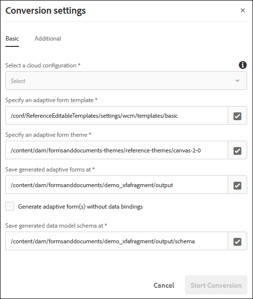
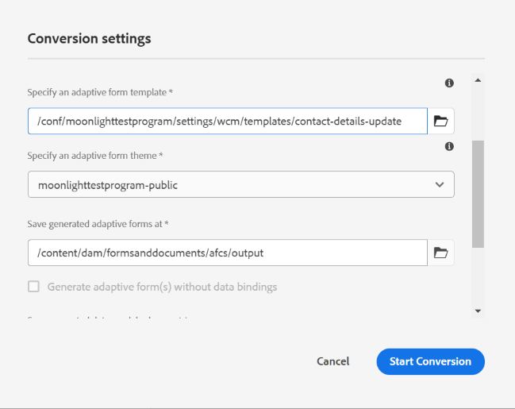

# 將PDF forms轉換為最適化表單 {#convert-print-forms-to-adaptive-forms}

AEM Forms Automated Forms Conversion服務(AFCS)採用Adobe Sensei技術，可自動將您的PDF forms轉換為適合裝置的回應式調適型表單<!--foundation and [core components](https://experienceleague.adobe.com/en/docs/experience-manager-core-components/using/adaptive-forms/introduction)-->。 無論您使用非互動式PDF forms、Acro Forms或XFA型PDF forms，自動錶單轉換服務(AFCS)可輕鬆將這些表單轉換為最適化表單。 如需功能、轉換工作流程和上線資訊的相關資訊，請參閱[自動錶單轉換](introduction.md)服務。

## 必要條件 {#pre-requisites}

* [**設定轉換服務**](configure-service.md)

* **準備要套用至轉換表單的[範本](https://helpx.adobe.com/experience-manager/6-5/forms/using/template-editor.html)：**&#x200B;使用範本可讓您將一致的品牌套用至所有最適化表單。 此外，自動錶單轉換服務(AFCS)不會擷取並使用來源PDF檔案的頁首與頁尾。 您可以使用最適化表單範本來指定頁首與頁尾。 範本中指定的頁首和頁尾會在轉換期間套用至最適化表單。 當您為範本建立資料夾時，請為每個人選取&#x200B;**[!UICONTROL Browse configurations]**&#x200B;選項。

* **準備要套用至轉換表單的[主題](https://helpx.adobe.com/experience-manager/6-5/forms/using/themes.html)：**&#x200B;使用主題可讓您將一致的樣式套用至組織的所有最適化表單。

* **（選擇性）** [**將您的來源PDF forms轉換為Adobe Sign表單**](frequently-asked-questions.md)

## 開始轉換流程 {#start-the-conversion-process}

將AEM執行個體與AEM Forms Conversion Service連線後，您就可以將PDF forms轉換為最適化表單。 以所列順序執行以下步驟，轉換表單：

* [將PDF forms上傳至您的AEM Forms伺服器](convert-existing-forms-to-adaptive-forms.md#upload-pdf-forms-to-your-aem-forms-server)
* [執行轉換](convert-existing-forms-to-adaptive-forms.md#run-the-conversion)
* [檢閱並修正轉換後的表單](review-correct-ui-edited.md)

### 將PDF forms上傳至您的AEM Forms伺服器 {#upload-pdf-forms-to-your-aem-forms-server}

轉換服務會將您AEM Forms例項上可用的PDF forms轉換為最適化表單。 您可以一次上傳所有PDF forms，也可以視需要分階段上傳。 在上傳表單前，請參閱以下提醒：

* 將資料夾中的表單數保持在15個以內，將資料夾中的總頁數保持在50個以內。
* 將資料夾大小保持在10 MB以下。 請勿將表單放在子資料夾中。
* 將表單的頁數保持在15頁以下。
* 請勿上傳受保護的表單。 此服務無法轉換受密碼保護和安全的表單。
* 請勿上傳檔案名稱中帶有空格的來源表單。 上傳表單前，請先移除檔案名稱中的空格。
* 請勿上傳 [PDF Portfolio](https://helpx.adobe.com/acrobat/using/overview-pdf-portfolios.html)。 此服務無法將PDF Portfolio轉換為最適化表單。
* 閱讀[已知問題](known-issues.md)和[最佳實務和考量](styles-and-pattern-considerations-and-best-practices.md)區段，並對表單進行建議的變更。

執行以下步驟，上傳要轉換至AEM Forms執行個體資料夾的表單：

1. 登入AEM Forms執行個體。
1. 點選&#x200B;**[!UICONTROL Adobe Experience Manager]**  > **[!UICONTROL Navigation]**  > **[!UICONTROL Forms]** > **[!UICONTROL Forms & Documents]**。
1. 點選&#x200B;**[!UICONTROL Create]**> **[!UICONTROL Folder]**。 指定資料夾的&#x200B;**標題**&#x200B;和&#x200B;**名稱**。 點選 **[!UICONTROL Create]**。資料夾已建立。
1. 點選以開啟新建立的資料夾。
1. 點選&#x200B;**[!UICONTROL Create]**> **[!UICONTROL File Upload]**。 選取要上載的表單，按一下&#x200B;**[!UICONTROL Open]**，然後按一下&#x200B;**[!UICONTROL Upload]**。 表單已上傳。

### 執行轉換 {#run-the-conversion}

上傳表單並設定服務後，請執行以下步驟以開始轉換：

1. 在您的AEM Forms執行個體上，點選&#x200B;**[!UICONTROL Adobe Experience Manager]**  > **[!UICONTROL Navigation]**  > **[!UICONTROL Forms]** > **[!UICONTROL Forms & Documents]**。
1. 選取包含PDF forms （要轉換的表單）的表單或資料夾，然後點選&#x200B;**[!UICONTROL Start Automated Conversion]**。 **[!UICONTROL Conversion Settings]**&#x200B;對話方塊隨即顯示。

   

   **將PDF轉換為最適化表單核心元件**

   此功能在早期採用者計畫之下。 您可以從您的官方電子郵件ID寫信到aem-forms-ea@adobe.com ，以加入率先採用者計畫並請求存取該功能。

   將PDF forms轉換為以基礎為基礎的表單時，需要上述轉換設定。 若要將PDF表單轉換為核心元件式的最適化表單：

   1. 請確保已在您的AEM Forms執行個體上啟用[核心元件](https://experienceleague.adobe.com/en/docs/experience-manager-core-components/using/adaptive-forms/introduction)。 如果未啟用，您可以[在您的AEM 6.5](https://experienceleague.adobe.com/en/docs/experience-manager-65/content/forms/adaptive-forms-core-components/enable-adaptive-forms-core-components)或[Cloud Service環境](https://experienceleague.adobe.com/en/docs/experience-manager-cloud-service/content/forms/setup-configure-migrate/enable-adaptive-forms-core-components)上啟用核心元件。
   1. 選取以[核心元件為基礎的最適化表單範本和主題](https://experienceleague.adobe.com/en/docs/experience-manager-core-components/using/adaptive-forms/sample-themes-templates-form-data-models-core-components)，如下圖所示：
      。
   1. 點選&#x200B;**[!UICONTROL Start Conversion]**&#x200B;以將PDF轉換為以核心元件為基礎的表單。
   >[!NOTE]
   > * 資料繫結或資料模型結構描述等屬性不適用於核心元件式最適化表單，但基礎元件可使用相同屬性。
   > * [檢閱並修正轉換後的表單](#review-and-correct-the-converted-forms)不適用於核心元件型表單。

1. 在[轉換設定]對話方塊的&#x200B;**[!UICONTROL Basic]**&#x200B;標籤中：

   * **[!UICONTROL Select a cloud configuration]**。當您選取組態時，已指定預設範本和主題。 您可以視需要指定不同的範本或主題。
   * 指定儲存所產生的最適化表單和對應結構描述的位置。 您可以使用預設路徑或指定自訂路徑。
   * 使用&#x200B;**產生沒有資料模型繫結的最適化表單**選項，選取是否要產生具有或不具有資料模型繫結的最適化表單。
如果您未選取此選項，轉換服務會自動將最適化表單與JSON結構描述相關聯，並在最適化表單和JSON結構描述中可用的欄位之間建立資料繫結。 **[!UICONTROL Save generated data model schema at]**欄位會顯示儲存產生的JSON結構描述的預設位置。 您也可以自訂位置以儲存產生的結構描述。
如果您選取此選項，轉換服務會產生沒有資料模型繫結的調適型表單。 成功轉換後，您可以將最適化表單與表單資料模型、XML結構描述或JSON結構描述建立關聯。 如需詳細資訊，請參閱[建立最適化表單](https://helpx.adobe.com/experience-manager/6-5/forms/using/creating-adaptive-form.html)。

   <!--

   Comment Type: draft

   <note type="note">
   
The XDP or XFA-based PDF form is not used to generate the Document of Record. The conversion service auto-generates the Document of Record only if you enable the Tools &gt; Cloud Services &gt; Automated Forms Conversion Configuration &gt; <strong>&lt;Properties of selected configuration&gt; &gt;</strong> Advanced &gt; Generate Document of Record option.

   
 

   </note>
   -->

1. 在「轉換設定」對話方塊的&#x200B;**[!UICONTROL Additional]**&#x200B;標籤中，
   * 選取&#x200B;**[!UICONTROL Extract fragment from adaptive forms]**&#x200B;選項，讓轉換服務識別、擷取及下載轉換表單的表單片段。 當您選取&#x200B;**[!UICONTROL Extract fragment from adaptive forms]**&#x200B;選項時，會啟用用於指定儲存擷取之表單片段和對應表單片段結構描述的路徑的選項。
   * 如果您有一些現有的JSON結構描述型和非結構描述型最適化表單片段，而且您打算在自動產生的最適化表單中使用這些片段，請指定&#x200B;**[!UICONTROL existing adaptive form fragments]**&#x200B;的位置。 轉換服務會將可用的JSON結構描述型和無結構描述的最適化表單片段與輸入PDF forms (僅限非互動式PDF forms)進行比對，如果有相符專案，對應的最適化表單中就會使用相符的自適應表單片段。

   >[!NOTE]
   >
   >
   > * 您一次只能使用&#x200B;**[!UICONTROL  Extract Fragment]**&#x200B;或&#x200B;**[!UICONTROL Use existing adaptive form fragments]**&#x200B;選項。 您無法同時使用這兩個選項。
   > * **[!UICONTROL Use existing adaptive form fragments]**&#x200B;選項只能與非互動式PDF forms搭配使用。 尚未支援其他表單型別。
   > * 您只能使用未繫結的片段或透過自動轉換服務繫結至JSON結構描述的片段。 請勿使用XFA片段。 不支援XFA片段。
   >

   * 選取&#x200B;**[!UICONTROL Auto-detect multi-column layout of input forms]**&#x200B;選項，以保留大型熒幕（如桌上型電腦和筆記型電腦）的來源表單版面配置。 選項有助於保留來源表單的多欄版面配置。 例如，當來源PDF有兩個欄的版面配置時，該服務會產生輸出回應式表單，其中有兩個欄的版面配置適用於大熒幕顯示器，而單欄的版面配置適用於小熒幕裝置，例如行動電話。 此功能在資料來源結構描述結構方面有一些已知問題。 如需詳細資訊，請參閱[已知問題](known-issues.md)文章。
   * 在預設狀態中，此服務會為 PDF 表單的每一頁分別建立頂層面板。 現在，您可以使用&#x200B;**[!UICONTROL Auto-detect logical sections]**&#x200B;選項來不建立頁面層級面板（以頁碼為基礎的面板），而僅建立邏輯面板。 這個選項還可將不屬於任何具有前置邏輯區段之區段的欄位，與橫跨至兩個相鄰頁面的邏輯區段的欄位合併成一個邏輯區段。 例如，如果邏輯區段中有些欄位位於第一頁底部，有些位於第二頁頂部，則所有該欄位都會合併成一個邏輯區段。

     >[!NOTE]
     > 您需要聯結器封裝1.1.38或更高版本才能使用&#x200B;**[!UICONTROL Auto-detect logical sections]**&#x200B;功能。

* (僅限AEM Forms as a Cloud Service) [自動將區段轉換為片段]選項適用於超過15頁的PDF forms。 這會將偵測到的頂層區段轉換為片段。 它也會啟用所有已建立片段的延遲載入。 它有助於提高轉換表單的渲染速度，並使在自適應表單編輯器中載入大型表單變得更容易。

  >[!NOTE]
  > 使用「自動將區段轉換為片段」選項時，請勿使用回應式版面範本。
  > 使用檢閱和修正編輯器將小型面板合併為大型面板。 這有助於減少轉換後的最適化表單中的片段數量。
  > 如果您遇到「呼叫次數過多」的例外狀況，
  >
  > * 重新建構表單以建立簡化的階層
  > * [將sling.max.calls引數]的值增加到足夠高的數字，直到例外狀況消失。
  > * [增加快取的大小](https://experienceleague.adobe.com/docs/experience-manager-65/forms/install-aem-forms/configure-aem-forms/configure-adaptive-forms-cache.html)。 如果表單太複雜、表格數量很大且有多層級階層結構，則會發生錯誤。

1. 點選 **[!UICONTROL Start Conversion]**。轉換已開始。 轉換進度會顯示在資料夾或表單上，直到轉換進行中為止。 轉換完成後，訊息會被另一個狀態訊息（「已轉換」、「已部分轉換」或「轉換失敗」）取代。 轉換完成時，也會在設定的電子郵件地址上傳送狀態電子郵件：

   * 成功轉換後，轉換的最適化表單和相關結構描述會下載到轉換對話方塊的&#x200B;**[!UICONTROL Basic]**&#x200B;索引標籤中指定的路徑。 只有在開始轉換前選取擷取片段選項時，才會下載表單片段和對應的結構描述。
   * 在轉換失敗時，如果所有輸入表單都無法轉換，則會顯示&#x200B;**[!UICONTROL Conversion Failed]**&#x200B;訊息，或者如果只有少數幾個輸入表單無法轉換，則會顯示&#x200B;**[!UICONTROL Partially Failed]**&#x200B;訊息。 已在[設定的電子郵件地址](configure-service.md#configureemailnotification)上傳送狀態電子郵件，並會將錯誤記錄到error.log檔案中。

   如果您將XFA型PDF表單轉換為最適化表單，轉換服務會自動將PDF表單與已轉換的最適化表單建立關聯，作為記錄檔案範本。 轉換後，您可以開啟最適化表單屬性，以在&#x200B;**[!UICONTROL Form Model]**&#x200B;索引標籤的&#x200B;**[!UICONTROL Document of Record Template Configuration]**&#x200B;區段中檢視記錄檔案範本。 

   只有當您啟用&#x200B;**[!UICONTROL Tools]** > **[!UICONTROL Cloud Services]** > **[!UICONTROL Automated Forms Conversion Configuration]** > **[!UICONTROL Properties of selected configuration]** > **[!UICONTROL Advanced]** > **[!UICONTROL Generate Document of Record]**&#x200B;選項時，轉換服務才會自動將PDF表單上傳到已轉換的最適化表單作為記錄檔案範本。

   <!--

   Comment Type: draft

   <note type="note">
   
By default, the adaptive form produces a JSON schema instead of XML schema on submission. JSON schema of a converted adaptive form is complaint with XML schema of an XFA-based form. You can use the <a href="https://sling.apache.org/apidocs/sling5/org/apache/sling/commons/json/xml/XML.html#toString">org.apache.sling.commons.json.xml API</a> to convert a JSON schema to XML schema. You can also use the following sample code for conversion:

   
<code class="code">import org.apache.sling.commons.json.JSONException;
   <discoiqbr /> import org.apache.sling.commons.json.JSONObject;
   <discoiqbr /> import org.apache.sling.commons.json.xml.XML;
   <discoiqbr />
   <discoiqbr /> public class ConversionUtils {
   <discoiqbr />
   <discoiqbr /> public static String jsonToXML(String jsonString) throws JSONException {
   <discoiqbr /> //https://sling.apache.org/apidocs/sling5/org/apache/sling/commons/json/xml/XML.html#toString(java.lang.Object)
   <discoiqbr /> //jar - http://maven.ibiblio.org/maven2/org/apache/sling/org.apache.sling.commons.json/2.0.18/
   <discoiqbr /> //Note: Need to extract boundData part before converting to XML
   <discoiqbr /> return XML.toString(new JSONObject(jsonString));
   <discoiqbr /> }
   <discoiqbr /> }</code>  

   </note>
   -->

   >[!NOTE]
   >
   >如果轉換過程需要60分鐘以上的時間，而PDF表單仍未轉換為最適化表單，請在AEM Forms執行個體上建立資料夾，將PDF表單上傳到新建立的資料夾，然後重新啟動轉換。

## 檢閱並修正轉換後的表單 {#review-and-correct-the-converted-forms}

現實世界的表單有複雜的資料擷取需求。 自動轉換完成後，客戶可以檢閱表單的轉換品質，並對表單進行必要的更新。 AEM Forms提供[檢閱並修正](review-correct-ui-edited.md)編輯器，以進行必要的變更。 它可讓您改善表單欄位的自動識別，並將識別的欄位從一種型別轉換為另一種型別。 例如，您可以協助識別表單的雙欄版面配置，並將自動識別為選項按鈕的欄位變更為多個選擇欄位。
