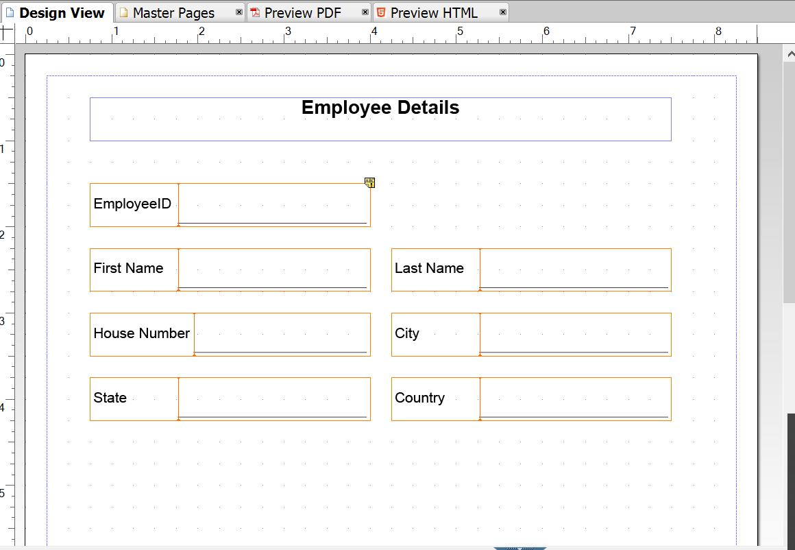

# 啟用最適化表單生成記錄檔案的建議工作流程 {#recommended-workflows-dor-generation}

記錄檔案(DoR)可讓您以最適化表單來記錄您提供和提交的資訊，以便您稍後可以參考這些資訊。
DoR會使用基礎範本來定義其版面。 您可以使用預設範本或將任何其他範本與最適化表單建立關聯來產生DoR。

如需產生DoR的詳細資訊，請參閱[產生最適化表單的記錄檔案](https://helpx.adobe.com/experience-manager/6-5/forms/using/generate-document-of-record-for-non-xfa-based-adaptive-forms.html)。

[Automated forms conversion服務(AFCS)](/help/using/introduction.md)將下列來源表單轉換為最適化表單：

* 非互動式PDF forms
* Acro Forms
* XFA型PDF forms

根據您用於轉換的來源表單，您可以使用以下方式產生DoR：

* 預設範本
* 將來源表單設為範本 — 如果您選取此選項，轉換服務會自動將來源表單與轉換後的適用性表單建立關聯，做為DoR範本。
* 將任何其他範本與轉換後的自適應表單建立關聯

下表說明您使用的DoR範本如何影響所產生DoR的版面配置範例：

<table> 
 <tbody>
 <tr>
  <td>
<strong>Source表單</strong>
</td>
  <td>
<strong>已產生的DoR</strong>
</td> 
   </tr>
  <tr>
   <td></td>
   <td>
如果您使用預設範本來產生DoR： </td>
   </tr>
   <tr>
   <td></td>
   <td>
如果您使用來源表單作為產生DoR的範本： 
</td>
   </tr>
  </tbody>
</table>

如表中所示，如果您使用來源表單作為範本，DoR會保留來源表單的版面。
本文會說明根據三種來源表單型別產生DoR的建議路徑。

<table> 
 <tbody> 
  <tr> 
   <th><strong>Source表單</strong></th> 
   <th><strong>產生DoR的方法</strong></th> 
  </tr> 
  <tr> 
   <td>
非互動式PDF forms
</td> 
   <td> 
    <ul> 
     <li><a href="#generate-document-of-record-using-cloud-configuration">啟用最適化表單轉換前的DoR產生，以使用預設範本產生DoR</a></li> 
     <li><a href="#edit-adaptive-form-properties-generate-document-of-record">在自適應表單轉換後編輯自適應表單屬性，以使用預設或任何其他表單範本產生DoR</a></li> 
    </ul> </td> 
  </tr>
  <tr> 
   <td>
Acro Forms或XFA型PDF forms
</td> 
   <td> 
    <ul> 
     <li><a href="#use-input-form-as-template-to-generate-document-of-record">啟用最適化表單轉換前的DoR產生，以使用來源表單作為範本來產生DoR</a></li> 
     <li><a href="#edit-adaptive-form-properties-to-generate-document-of-record">編輯最適化表單轉換後的最適化表單屬性，以啟用使用預設範本、來源表單作為範本或任何其他表單範本產生DoR</a></li> 
    </ul> </td> 
  </tr>    
 </tbody> 
</table>

## 為非互動式PDF forms產生記錄檔案 {#generate-document-of-record-non-interactive-pdf}

如果您使用非互動式PDF表單做為Automated forms conversion服務(AFCS)的來源表單，您可以：

* 啟用最適化表單轉換前的DoR產生，以使用預設範本產生DoR
* 或編輯最適化表單轉換後的最適化表單屬性，以使用預設或任何其他表單範本產生DoR

### 啟用轉換前的DoR產生，以使用預設範本產生DoR {#generate-document-of-record-using-cloud-configuration}

1. 選取&#x200B;**[!UICONTROL Tools]** > **[!UICONTROL Cloud Services]** > **[!UICONTROL Automated Forms Conversion Configuration]** >用於轉換的雲端組態屬性> **[!UICONTROL Advanced]** > **[!UICONTROL Generate Document of Record]**&#x200B;選項。

   

1. 點選&#x200B;**[!UICONTROL Save & Close]**&#x200B;以儲存設定。

1. [執行轉換](/help/using/convert-existing-forms-to-adaptive-forms.md)。 請確定您使用這些指示步驟1中編輯的雲端設定。
提交轉換後的自適應表單時，會使用預設範本自動產生DoR。

### 在轉換後編輯最適化表單屬性以啟用DoR產生 {#edit-adaptive-form-properties-generate-document-of-record}

如果您在將來源表單轉換為最適化表單之前，未啟用DoR產生功能，轉換後您仍可這麼做。

1. [在非互動式PDF表單上執行轉換](/help/using/convert-existing-forms-to-adaptive-forms.md)，以產生最適化表單。

1. 在&#x200B;**[!UICONTROL output]**&#x200B;資料夾中選取最適化表單，然後點選&#x200B;**[!UICONTROL Properties]**。

1. 在&#x200B;**[!UICONTROL Form Model]**&#x200B;標籤中，展開&#x200B;**[!UICONTROL Document of Record Template Configuration]**&#x200B;區段並選取&#x200B;**[!UICONTROL Generate Document of Record]**。

   

1. 點選&#x200B;**[!UICONTROL Save & Close]**&#x200B;以儲存設定。

提交轉換後的自適應表單時，會使用預設範本自動產生DoR。 如果您想要將任何其他DoR範本與轉換後的自適應表單建立關聯，可以選取&#x200B;**[!UICONTROL Associate form template as the Document of Record template]**&#x200B;選項。

## 為Acro Forms或XFA型PDF forms產生記錄檔案 {#generate-document-of-record-acroform-xfaform}

如果您使用Acro表單或XFA型PDF表單做為Automated forms conversion服務(AFCS)的來源表單，您可以：

* 啟用最適化表單轉換前的DoR產生，以使用來源表單作為範本來產生DoR

* 或編輯最適化表單轉換後的最適化表單屬性，以啟用使用預設範本、來源表單作為範本或任何其他表單範本產生DoR

### 啟用轉換前的DoR產生，以使用來源表單範本產生DoR {#use-input-form-as-template-to-generate-document-of-record}

1. 選取&#x200B;**[!UICONTROL Tools]** > **[!UICONTROL Cloud Services]** > **[!UICONTROL Automated Forms Conversion Configuration]** >用於轉換的雲端組態屬性> **[!UICONTROL Advanced]** > **[!UICONTROL Generate Document of Record]**&#x200B;選項。

1. 點選&#x200B;**[!UICONTROL Save & Close]**&#x200B;以儲存設定。

1. [執行轉換](/help/using/convert-existing-forms-to-adaptive-forms.md)。 請確定您使用這些指示步驟1中編輯的雲端設定。
轉換服務會自動將Acro表單或XFA型PDF表單與已轉換的最適化表單建立關聯，做為DoR範本。
您可以開啟最適化表單屬性，以在&#x200B;**[!UICONTROL Form Model]**&#x200B;索引標籤的&#x200B;**[!UICONTROL Document of Record Template Configuration]**&#x200B;區段中檢視DoR範本。

   

   提交轉換後的自適應表單時，會使用來源表單範本自動產生DoR。

### 在轉換後編輯最適化表單屬性以啟用DoR產生 {#edit-adaptive-form-properties-to-generate-document-of-record}

1. [在非互動式PDF表單上執行轉換](/help/using/convert-existing-forms-to-adaptive-forms.md)，以產生最適化表單。

1. 在&#x200B;**[!UICONTROL output]**&#x200B;資料夾中選取最適化表單，然後點選&#x200B;**[!UICONTROL Properties]**。

1. 在&#x200B;**[!UICONTROL Form Model]**&#x200B;標籤中，展開&#x200B;**[!UICONTROL Document of Record Template Configuration]**&#x200B;區段並選取&#x200B;**[!UICONTROL Generate Document of Record]**&#x200B;以啟用使用預設範本產生DoR。
您也可以選取&#x200B;**[!UICONTROL Associate form template as the Document of Record template]**&#x200B;選項並選取範本，以啟用使用來源表單範本或任何其他表單範本產生DoR。

1. 點選&#x200B;**[!UICONTROL Save & Close]**&#x200B;以儲存設定。
