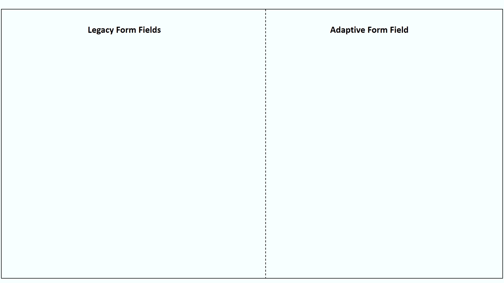

# 擴展預設元模型 {#extend-the-default-meta-model}

automated forms conversion服務(AFCS)會識別來源表單並從中擷取表單物件。 語意對應程式可協助服務決定如何以最適化表單呈現擷取的物件。 例如，來源表單可以有許多不同型別的日期表示。 語意對應程式有助於將來源表單的日期表單物件與調適型表單的日期元件對應到所有表示方式。 語意對應程式也允許服務在轉換期間預先設定並套用驗證、規則、資料模式、說明文字和協助工具屬性至調適型表單元件。



中繼模型是JSON結構描述。 開始使用中繼模型之前，請確定您已精通JSON。 您必須具備建立、編輯和讀取以JSON格式儲存之資料的經驗。

## 預設元模型 {#default-meta-model}

automated forms conversion服務(AFCS)有預設的中繼模型。 它是JSON結構描述，並與Adobe服務(AFCS)的其他元件一起駐留在Automated forms conversion雲端。 您可以在下列網址，在本機AEM伺服器上找到中繼模型的復本： http://&lt;server>：&lt;port>/aem/forms.html/content/dam/formsanddocuments/metamodel/`global.schema.json`。 您也可以[按一下這裡](assets/en.globalschema.json)來存取或下載英文結構描述。 [法文](assets/fr.globalschema.json)、[德文](assets/de.globalschema.json) [西班牙文](assets/es.globalschema.json)、[義大利文](assets/it.globalschema.json)和[葡萄牙文](assets/pt_br.globalschema.json)語言的中繼模型也可供下載。

中繼模型的結構描述衍生自https://schema.org/docs/schemas.html上的結構描述實體。 它有Person、PostalAddress、LocalBusiness和https://schema.org上定義的更多實體。 中繼模型的每個實體都會遵守JSON結構描述物件型別。 下列程式碼代表範例中繼模型結構：

```
   "Entity": {
      "id": "Entity",
      "properties": {
        "name": {
          "type": "string"
        },

        "description": {
          "type": "string",
          "description": "Description of the item"
        }
      }
    }
```

## 下載預設的中繼模型 {#download-the-default-meta-model}

執行以下步驟，將預設元模型下載至本機檔案系統：

1. 登入您的AEM Forms執行個體。
1. 導覽至&#x200B;**[!UICONTROL Forms]** > **[!UICONTROL Forms & Documents]** **>** **[!UICONTROL Meta Model]**&#x200B;資料夾。
1. 選取&#x200B;**[!UICONTROL global.schema.json]**&#x200B;檔案並點選&#x200B;**[!UICONTROL Download]**。 將會顯示下載對話方塊。 選取&#x200B;**[!UICONTROL Download asset(s) as binary files]**&#x200B;選項。 點選 **[!UICONTROL Download]**。已下載封存。

   <!--
   Comment Type: draft

   <li><p>Extract the archive and open the global.schema.json file for editing. </p> </li>
   -->

   <!--
   Comment Type: draft

   <li>Step text</li>
   -->

## 瞭解中繼模型 {#understanding-the-meta-model}

元模型是指包含實體的JSON結構描述檔案。 JSON結構描述檔案中的所有實體都會包含名稱和ID。 每個實體可以包含多個屬性。 圖元及其屬性會因領域而異。 您可以使用關鍵字和欄位設定來擴充結構描述檔案，以將結構描述屬性對應至最適化表單元件。

```
"Event": {
      "id": "Eventid",
      "allOf": [
        {
          "$ref": "#Entity"
        },
        {
          "properties": {
            "startDate": {
              "type": "string",
              "format": "date",
              "description": "Specify the start date and time of the event in ISO 8601 date format."
            },
            "endDate": {
              "type": "string",
              "format": "date",
              "description": "Specify the end date and time of the event in ISO 8601 date format."
            },
            "location": {
              "$ref": "#PostalAddress",
              "description": "Specify the location of the event."
            }
          }
        }
      ]
    }
```

在此範例中，**Event**&#x200B;代表&#x200B;**id**&#x200B;值為&#x200B;**Eventid**&#x200B;的實體名稱。 Event實體包含多個屬性：

* startDate
* endDate
* 位置

中繼模型中的&#x200B;**allOf**&#x200B;建構可啟用實體間的繼承。

每個屬性可進一步包含：

* [JSON結構描述屬性](#jsonschemaproperties)
* [關鍵字式搜尋，將屬性套用至產生的自適應表單欄位](#keywordsearch)
* [其他屬性](#additionalproperties)


轉換服務會根據使用&#x200B;**aem：affKeyword**&#x200B;所參考的關鍵字，對來源表單欄位執行搜尋作業。 轉換服務會將JSON結構描述屬性和其他屬性套用至符合搜尋條件的欄位。

在此範例中，轉換服務會在來源表單中搜尋電話、電話、行動電話、公司電話、住家電話、電話號碼、電話號碼和電話號碼關鍵字。 轉換服務會根據包含這些關鍵字的欄位，在轉換後將型別、模式和aem：afProperties套用至調適型表單欄位。

### 所產生的最適化表單欄位的JSON結構描述屬性 {#jsonschemaproperties}

中繼模型支援使用Automated forms conversion服務(AFCS)產生的調適型表單欄位的下列JSON結構描述共同屬性：

<table> 
 <tbody> 
  <tr> 
   <th><strong>屬性名稱</strong></th> 
   <th><strong>說明</strong></th> 
  </tr> 
  <tr> 
   <td><p>標題</p></td> 
   <td> 
    <p>中繼模型中title屬性內提及的文字可作為搜尋關鍵字，對產生的調適型表單欄位執行動作。 例如，修改最適化表單欄位的標籤。 如需詳細資訊，請參閱<a href="#custommetamodelexamples">自訂中繼模型範例中的<strong>修改表單欄位的標籤</strong>。</a></p> </td> 
  </tr>
  <td><p>說明</p></td> 
   <td> 
    <p>說明屬性會設定所產生的最適化表單欄位的說明文字。 如需詳細資訊，請參閱<a href="#custommetamodelexamples">自訂中繼模型範例中的<strong>新增說明文字至表單欄位</strong>。</a></p> </td> 
  </tr>
  <td><p>類型</p></td> 
   <td> 
    <p>type屬性會定義所產生的最適化表單欄位的資料型別。 標題屬性的可能值包括：</p>
    <ul> 
     <li>字串：產生文字資料型別的最適化表單欄位。</li> 
     <li>數字：產生數值資料型別的最適化表單欄位。</li>
     <li>integer：產生數值資料型別的自適應表單欄位，其子型別設定為integer。</li>
     <li>布林值：產生切換最適化表單元件。</li>
     </ul><p>如需在中繼模型中使用型別屬性的詳細資訊，請參閱<a href="#custommetamodelexamples">自訂中繼模型範例中的<strong>修改表單欄位的型別</strong>。</a></p></td> 
  </tr>
  <td><p>圖樣</p></td> 
   <td> 
    <p>pattern屬性會根據規則運算式來限制產生的最適化表單欄位的值。 例如，中繼模型中的下列程式碼會將所產生的最適化表單欄位的值限製為10位數： <br>"pattern"： "/\\d{10}/"<br>同樣地，中繼模型中的下列程式碼會將欄位的值限製為特定日期格式。<br> "pattern"： "date{DD MMMM， YYYY}"，</p> </td> 
  </tr>
  <td><p>格式</p></td> 
   <td> 
    <p>format屬性會根據具名模式而非規則運算式來限制產生的最適化表單欄位的值。 format屬性的可能值包括：<ul><li>電子郵件：產生電子郵件最適化表單元件。</li><li>hostname：產生文字方塊最適化表單元件。</li></ul>如需在中繼模型中使用格式屬性的詳細資訊，請參閱<a href="#custommetamodelexamples">自訂中繼模型範例中的<strong>修改表單欄位的格式</strong>。</a></p> </td> 
  </tr>
  <td><p>enum和enumNames</p></td> 
   <td> 
    <p>enum和enumNames屬性將下拉清單、核取方塊或選項按鈕欄位的值限製為固定集。 enumNames中列出的值會顯示在使用者介面上。 使用enum屬性列出的值會用於計算。<br>如需詳細資訊，請參閱<strong>將表單欄位轉換為最適化表單中的多選核取方塊</strong>、<strong>將文字欄位轉換為最適化表單中的下拉式清單</strong>以及<strong>在<a href="#custommetamodelexamples">自訂中繼模型範例中將其他選項新增到下拉式清單</strong>。</a></p> </td> 
  </tr>
 </tbody> 
</table>

### 關鍵字式搜尋，將屬性套用至產生的自適應表單欄位 {#keywordsearch}

automated forms conversion服務(AFCS)會在轉換期間在來源表單上執行關鍵字搜尋。 篩選符合搜尋條件的欄位後，轉換服務會將中繼模型中為這些欄位定義的屬性套用至產生的調適型表單欄位。

使用&#x200B;**aem：affKeyword**&#x200B;屬性參考關鍵字。

```
{
  "numberfields": {
      "type": "number",
      "aem:affKeyword": ["Bank account number"]
 }
}
```

在此範例中，轉換服務使用&#x200B;**aem：affKeyword**&#x200B;中的文字做為搜尋關鍵字。 擷取表單中的&#x200B;**銀行帳號**&#x200B;文字後，轉換服務會使用&#x200B;**type**&#x200B;屬性將欄位轉換為&#x200B;**number**&#x200B;型別。

### 產生的最適化表單欄位的其他屬性 {#additionalproperties}

您可以在中繼模型中使用&#x200B;**aem：afProperties**&#x200B;屬性，為使用Automated forms conversion服務(AFCS)產生的調適型表單欄位定義下列其他屬性：

<table> 
 <tbody> 
  <tr> 
   <th><strong>屬性名稱</strong></th> 
   <th><strong>說明</strong></th> 
  </tr> 
  <tr> 
   <td><p>多行</p></td> 
   <td> 
    <p>multiLine屬性在轉換後會將來源表單欄位轉換為最適化表單中的多行欄位。 如需詳細資訊，請參閱<a href="#custommetamodelexamples">自訂中繼模型範例中的<strong>將字串欄位轉換為多行欄位</strong>。</a></p> </td> 
  </tr>
  <td><p>強制</p></td> 
   <td> 
    <p>強制屬性會將轉換後的最適化表單欄位輸入設為強制。<br>如需詳細資訊，請參閱<a href="#custommetamodelexamples">自訂中繼模型範例中的<strong>新增驗證至最適化表單欄位</strong>。</a></p>
    </td> 
  </tr>
  <td><p>jcr:title</p></td> 
   <td> 
    <p>jcr：title屬性和title JSON結構描述屬性可讓您在轉換後修改最適化表單欄位的標籤。<br>如需詳細資訊，請參閱<a href="#custommetamodelexamples">自訂中繼模型範例中的<strong>修改表單欄位的標籤</strong>。</a><br>請參閱<a href="https://helpx.adobe.com/experience-manager/6-5/forms/using/adaptive-form-json-schema-form-model.html" target="_blank">使用JSON結構描述建立最適化表單</a>，以取得更多您可以使用JSON結構描述套用至最適化表單欄位的屬性資訊。</p>
    <p></p></td> 
  </tr>
  <td><p>sling：resourceType和guideNodeClass</p></td> 
   <td> 
    <p>sling：resourceType和guideNodeClass屬性可讓您將表單欄位對應到對應的調適型表單元件。<br>如需詳細資訊，請參閱<a href="#custommetamodelexamples">自訂中繼模型範例中的<strong>將表單欄位轉換為最適化表單中的複選核取方塊</strong>和<strong>將文字欄位轉換為最適化表單中的下拉式清單</strong>。</a></p> </td> 
  </tr>
  <td><p>validatePictureClause</p></td> 
   <td> 
    <p>validatePictureClause屬性會針對轉換後的最適化表單欄位中所允許的格式設定驗證。<br>如需詳細資訊，請參閱<a href="#custommetamodelexamples">自訂中繼模型範例中的<strong>新增驗證至最適化表單欄位</strong>。</p> </td> 
  </tr>
 </tbody> 
</table>

## 以您自己的語言建立自訂中繼模型{#language-specific-meta-model}

您可以建立特定語言的中繼模型。 這類中繼模型可協助您以您選擇的語言建立對應規則。 automated forms conversion服務(AFCS)可讓您使用下列語言建立中繼模型：

* English(en)
* French(fr)
* German(de)
* Spanish(es)
* Italian(it)
* 葡萄牙文(pt-br)

將&#x200B;*aem：Language* metatag標籤新增至中繼模型頂端，以指定其語言。 例如，

```JSON
"metaTags": {
        "aem:Language": "fr"
    }
```

若未指定語言，服務會認為中繼模型為英文。

### 建立特定語言中繼模型的注意事項

* 確定每個金鑰的名稱都是英文名稱。 例如，emailAddress。
* 請確定所有實體參照和所有ID鍵的預定義值只包含ASCII字元。 例如&quot;id&quot;： &quot;ContactPoint&quot; / &quot;$ref&quot;： &quot;#ContactPoint&quot;。
* 請確定與下列鍵值對應的所有值都使用指定的元模型語言：
   * aem：affKeyword
   * 標題
   * 說明
   * enumName
   * shortDescription
   * validatePictureClauseMessage

  例如，當中繼模型的語言是法文(「aem：Language」：「fr」)時，請確定所有說明和訊息都是法文。

* 請確定所有[JSON結構描述屬性](#jsonschemaproperties)都只使用支援的值。 例如，type屬性只能跨越字串、數字、整數和布林值的選取值。

下圖顯示英文中繼模型和對應的法文中繼模型的範例：


## 使用自訂中繼模型修改最適化表單欄位 {#modify-adaptive-form-fields-using-custom-meta-model}

除了預設元模型中列出的模式與驗證之外，您的組織還可以有這些模式與驗證。 您可以擴充預設元模型，以新增特定於貴組織的陣列、驗證和圖元。 automated forms conversion服務(AFCS)會在轉換期間將自訂中繼模型套用至表單欄位。 當發現組織特定的新陣列、驗證和圖元時，您可以繼續更新元模型。

automated forms conversion服務(AFCS)會使用儲存在下列位置的預設中繼模型，在轉換期間將來源表單欄位對應到調適型表單欄位：

http://&lt;server>：&lt;port>/aem/forms.html/content/dam/formsanddocuments/metamodel/global.schema.json

不過，您可以將自訂中繼模型儲存在資料夾中，並修改轉換服務屬性以在轉換期間使用自訂中繼模型。

### 在轉換期間使用自訂中繼模型 {#use-custom-meta-model-during-conversion}

執行以下步驟以在轉換期間使用自訂中繼模型：

1. 在&#x200B;**[!UICONTROL Forms]** > **[!UICONTROL Forms & Documents]**&#x200B;中建立資料夾，並將自訂中繼模型JSON結構描述檔案上傳至資料夾。
1. 使用以下專案開啟轉換服務屬性：

   **[!UICONTROL Tools]** > **[!UICONTROL Cloud Services]** > **[!UICONTROL Automated Forms Conversion Configuration]** > **&lt;所選組態的屬性>**

1. 在&#x200B;**[!UICONTROL Basic]**&#x200B;索引標籤中，在&#x200B;**[!UICONTROL Custom Meta-model]**&#x200B;欄位中指定自訂中繼模型的位置，然後點選&#x200B;**[!UICONTROL Save & Close]**。
1. [執行轉換](convert-existing-forms-to-adaptive-forms.md#start-the-conversion-process)，將自訂中繼模型套用至轉換程式。

### 自訂中繼模型範例 {#custommetamodelexamples}

使用自訂中繼模型修改最適化表單欄位屬性的常見範例包括：

* 修改表單欄位的標籤
* 修改表單欄位的型別
* 新增說明文字至表單欄位
* 將表單欄位轉換為最適化表單中的多選單選按鈕
* 修改表單欄位的格式
* 將驗證新增至最適化表單欄位
* 將表單欄位轉換為最適化表單中的下拉式清單選項
* 新增其他選項至下拉式清單
* 將字串欄位轉換為多行欄位

#### 修改表單欄位的標籤 {#modify-the-label-of-a-form-field}

**範例：**&#x200B;將表單中的銀行帳號標籤修改成最適化表單中的自訂帳號。

在此自訂中繼模型中，轉換服務使用&#x200B;**title**&#x200B;屬性作為搜尋關鍵字。 擷取表單中的&#x200B;**銀行帳號**&#x200B;文字後，轉換服務會以&#x200B;**aem：afProperties**&#x200B;區段中&#x200B;**jcr：title**&#x200B;屬性提及的&#x200B;**客戶帳號**&#x200B;字串取代文字。

```
{
  "numberfields": {
      "type": "number",
   "title": "Bank account number",
   "aem:afProperties" : {
    "jcr:title" : "Customer account number"
   }
   }
}
```

#### 修改表單欄位的型別 {#modify-the-type-of-a-form-field}

**範例**：先修改表單中文字型別的&#x200B;**銀行帳號**&#x200B;欄位，然後再轉換至最適化表單中的數字型別欄位。

在此自訂中繼模型中，轉換服務使用&#x200B;**aem：affKeyword**&#x200B;中的文字作為搜尋關鍵字。 擷取表單中的&#x200B;**銀行帳號**&#x200B;文字後，轉換服務會使用&#x200B;**type**&#x200B;屬性將欄位轉換為數字型別。

```
{
  "numberfields": {
      "type": "number",
      "aem:affKeyword": ["Bank account number"]
 }
}
```

#### 新增說明文字至表單欄位 {#add-help-text-to-a-form-field}

**範例**：將說明文字新增至最適化表單的&#x200B;**銀行帳號**&#x200B;欄位。

在此自訂中繼模型中，轉換服務使用&#x200B;**aem：affKeyword**&#x200B;中的文字作為搜尋關鍵字。 擷取表單中的&#x200B;**銀行帳號**&#x200B;文字後，轉換服務會使用&#x200B;**說明**&#x200B;屬性將說明文字新增至最適化表單欄位。

```
{
  "numberfields": {
      "type": "number",
      "aem:affKeyword": ["Bank account number"],
   "description": "Specify your bank account number."
 }
}
```

#### 將表單欄位轉換為最適化表單中的多選核取方塊 {#convert-a-form-field-to-multiple-choice-check-boxes-in-the-adaptive-form}

**範例**：轉換前先將表單中字串型別的&#x200B;**國家**&#x200B;欄位轉換為轉換後最適化表單中的核取方塊。

在此自訂中繼模型中，轉換服務使用&#x200B;**aem：affKeyword**&#x200B;中的文字作為搜尋關鍵字。 擷取表單中的&#x200B;**國家/地區**&#x200B;文字後，轉換服務會使用&#x200B;**列舉**&#x200B;屬性將欄位轉換為下列核取方塊：

* 印度
* 英國
* 澳洲
* 紐西蘭

**sling：resourceType**&#x200B;和&#x200B;**guideNodeClass**&#x200B;屬性將表單欄位對應至核取方塊最適化表單元件。

```
{
"title": {
    "aem:affKeyword": [
      "country"
    ],
    "type" : "string",
    "enum": [
      "India",
      "England",
      "Australia",
      "New Zealand"
    ],
    "aem:afProperties": {
      "sling:resourceType": "fd/af/components/guidecheckbox",
      "guideNodeClass": "guidecheckbox"
    }
  }
}
```

#### 修改表單欄位的格式 {#modify-the-format-of-a-form-field}

**範例**：將&#x200B;**電子郵件地址**&#x200B;欄位的格式修改成電子郵件格式。

在此自訂中繼模型中，轉換服務使用&#x200B;**aem：affKeyword**&#x200B;中的文字作為搜尋關鍵字。 擷取表單中的&#x200B;**電子郵件地址**&#x200B;文字後，轉換服務會使用&#x200B;**格式**&#x200B;屬性將欄位轉換為電子郵件格式。

```
{
   "additionalDetails" : {
      "aem:affKeyword": ["E-mail Address"],
       "type" : "string",
       "format" : "email"
  } 
}
```

#### 將驗證新增至最適化表單欄位 {#add-validations-to-adaptive-form-fields}

**範例1：**&#x200B;新增驗證至最適化表單的&#x200B;**郵遞區號**&#x200B;欄位。

在此自訂中繼模型中，轉換服務使用&#x200B;**aem：affKeyword**&#x200B;中的文字作為搜尋關鍵字。 擷取表單中的&#x200B;**郵遞區號**&#x200B;文字後，轉換服務會使用&#x200B;**aem：afProperties**&#x200B;區段中定義的&#x200B;**validatePictureClause**&#x200B;屬性，將驗證新增至欄位。 根據驗證，您在轉換後為最適化表單中的&#x200B;**郵遞區號**&#x200B;欄位指定的輸入必須包含6個字元。

```
{
   "postalCode" : {
      "aem:affKeyword": ["Postal Code"],
      "type" : "string",
      "aem:afProperties" : {
        "validatePictureClause" : "\\d{6}"
      } 
   }
}
```

**範例2：**&#x200B;新增驗證至最適化表單的&#x200B;**銀行帳號**&#x200B;欄位。

在此自訂中繼模型中，轉換服務使用&#x200B;**aem：affKeyword**&#x200B;中的文字作為搜尋關鍵字。 擷取表單中的&#x200B;**銀行帳號**&#x200B;文字後，轉換服務會使用&#x200B;**aem：afProperties**&#x200B;區段中定義的&#x200B;**強制**&#x200B;屬性，將驗證新增至欄位。 根據驗證，您必須先指定&#x200B;**銀行帳號**&#x200B;欄位的值，才能在轉換後提交表單。

```
{
  "numberfields": {
      "type": "number",
      "aem:affKeyword": ["Bank account number"],
   "aem:afProperties" : {
        "mandatory": "true"
      }   
   }
}
```

#### 將文字欄位轉換為最適化表單中的下拉式清單 {#convert-a-text-field-to-drop-down-list-in-the-adaptive-form}

**範例**：轉換前先將表單中字串型別的&#x200B;**國家**&#x200B;欄位轉換為轉換後最適化表單中的下拉式選項。

在此自訂中繼模型中，轉換服務使用&#x200B;**aem：affKeyword**&#x200B;中的文字作為搜尋關鍵字。 擷取表單中的&#x200B;**國家/地區**&#x200B;文字後，轉換服務會使用&#x200B;**列舉**&#x200B;屬性將欄位轉換為下列下拉式清單選項：

* 印度
* 英國
* 澳洲
* 紐西蘭

**sling：resourceType**&#x200B;和&#x200B;**guideNodeClass**&#x200B;屬性將表單欄位對應到下拉式最適化表單元件。

```
{
"title": {
    "aem:affKeyword": [
      "country"
    ],
    "type" : "string",
    "enum": [
      "India",
      "England",
      "Australia",
      "New Zealand"
    ],
    "aem:afProperties": {
      "sling:resourceType": "fd/af/components/guidedropdownlist",
      "guideNodeClass": "guideDropDownlist"
    }
  }
}
```

#### 新增其他選項至下拉式清單 {#add-additional-options-to-the-drop-down-list}

**範例：**&#x200B;使用自訂中繼模型，將&#x200B;**Sri Lanka**&#x200B;新增為現有下拉式清單的額外選項。

若要新增額外選項，請使用新選項更新&#x200B;**enum**&#x200B;屬性。 在此範例中，將&#x200B;**enum**&#x200B;屬性更新為&#x200B;**Sri Lanka**&#x200B;作為額外選項。 **列舉**&#x200B;屬性的值會顯示在下拉式清單中。

```
{
"title": {
    "aem:affKeyword": [
      "country"
    ],
    "type" : "string",
    "enum": [
      "India",
      "England",
      "Australia",
      "New Zealand",
   "Sri Lanka"
    ],
    "aem:afProperties": {
      "sling:resourceType": "fd/af/components/guidecheckbox",
      "guideNodeClass": "guidecheckbox"
    }
  }
}
```

#### 將字串欄位轉換為多行欄位 {#convert-a-string-field-to-a-multi-line-field}

**範例：**&#x200B;轉換後，將字串型別的&#x200B;**Address**&#x200B;欄位轉換為表單中的多行欄位。

在此自訂中繼模型中，轉換服務使用&#x200B;**aem：affKeyword**&#x200B;中的文字作為搜尋關鍵字。 擷取表單中的&#x200B;**位址**&#x200B;文字後，服務會使用&#x200B;**aem：afProperties**&#x200B;區段中定義的&#x200B;**multiLine**&#x200B;屬性，將文字欄位轉換為多行欄位。

```
{
 "multiLine" : {
   "aem:affKeyword": [
      "Address"
    ],
    "type" : "string",
    "aem:afProperties": {
      "multiLine": "true"
    }
  }
}
```
