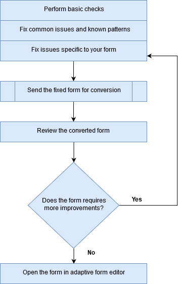

# 檢閱並修正轉換後的表單{#review-and-correct-converted-forms}

AEM FormsAutomated forms conversion服務會識別輸入PDF檔案的欄位、內容和版面，並將PDF檔案轉換為最適化表單。 輸出最適化表單可能會有幾個欄位遺失或錯誤轉換。 您可以使用「稽核並修正」編輯器來改善已識別的欄位，並重新產生調適型表單，使輸出更接近所需的體驗。 第一次轉換後，您可以在編輯器中開啟輸入PDF檔案，以：

* 檢視轉換期間識別的所有欄位和內容
* 識別轉換期間遺漏的欄位和內容
* 驗證欄位的型別並變更其型別（如果需要）
* 驗證已識別的表格、調整欄大小並修改儲存格內容
* 移除錯誤識別的欄位

進行必要的變更後，將PDF forms重新傳送至轉換服務。 成功轉換後，更新的資產（包括最適化表單和結構描述）會下載至您的AEM Forms執行個體。 您可以重複此程式，直到達到所需的體驗為止。 

您需要Google Chrome、Mozilla FireFox或Microsoft Edge瀏覽器才能使用檢閱和修正編輯器。 編輯器不支援Internet Explorer。

## 歡迎使用檢閱和修正編輯器 {#welcome-to-review-and-correct-editor}

「稽核並修正」編輯器提供易於使用的介面。 它有下列元件：

* 內容瀏覽器：您可以使用內容瀏覽器來變更元素的位置。 內容瀏覽器可讓您拖放表單物件以變更其位置。 例如，在文字方塊之前移動表格。 這會相應地變更輸出最適化表單的索引標籤順序。
* 屬性瀏覽器：顯示所選欄位的屬性。 您也可以修改屬性。
* 工具列：工具列在編輯器頂端。 它會顯示用於新增、修改、分組、取消分組和刪除欄位的工具。
* 開啟屬性：點選「 」時顯示「開啟屬性」選項。  圖示。 您可以按一下「開啟屬性」來開啟表單屬性並檢視其他選項。
* 篩選按鈕：篩選按鈕  位於編輯器頂端。 它可讓您篩選欄位以僅顯示文字、欄位、選擇群組、面板或所有元件。
* 儲存按鈕： **[!UICONTROL Save]** 按鈕在編輯器的右上角。 您也可以使用儲存按鈕旁的箭頭，檢視傳送表單進行轉換的選項。

* PDF表單：編輯器顯示來源PDF檔案，並以已識別欄位將其覆蓋。 您可以使用工具列中的工具來修改欄位。
* 頁面：來源表單可以有多個頁面。 編輯器在右上角提供一個按鈕，用於在頁面之間導覽。

**答：** 內容瀏覽器 **B.** 屬性瀏覽器 **C.** 工具列 **D.** 屬性按鈕 **E.** 篩選按鈕 **F.** 儲存按鈕 **G.** 以已識別欄位覆蓋的PDF表單

首次成功轉換後，轉換服務會以已識別的欄位和元件覆蓋來源PDF檔案。 這些欄位或元件的型別為：文字、欄位、面板、選擇群組和表格：

* 文字：來源PDF檔案中的純文字。 例如，上方顯示影像中的貸款申請文字。
* 欄位：與值或輸入方塊相關聯的文字或圖示標籤組合。 例如，上述影像中的第一個欄位名稱。 它有文字標籤和輸入方塊。 欄位支援文字、數值、下拉式清單、日期、電子郵件、電話號碼、簽名、貨幣和密碼資料型別。
* 面板：內容和元件的邏輯集合。 例如，上圖中人員1和人員2的個人詳細資訊面板。
* 選擇群組：與多個選擇選項相關的文字組合：核取方塊和選項按鈕。 例如，上圖中的婚姻狀況和現有客戶。\
  轉換服務會根據選擇群組註解及其多選選項，自動將選擇群組轉換為單選單選按鈕或多選核取方塊。 例如，如果有 **選取任一** 由於選擇群組註解或多選選項僅允許您選取一個選項， **是** 或 **否**，轉換服務會自動將選擇群組轉換為單選按鈕。 同樣地，如果有 **選取所有適用專案** 或 **選取多個** 由於選擇群組註解或多選選項可讓您選取多個選項，轉換服務會自動將選擇群組轉換為多選核取方塊。

* 表格：以欄和列表示資訊的二維表格。 您可以在表格中新增或移除列或欄。

## 開始檢閱轉換 {#start-reviewing-a-conversion}

首次成功轉換後，轉換服務會以已識別的欄位和元件覆蓋來源PDF檔案。 您可以改善已識別的欄位，並重新產生最適化表單，使輸出更接近所需的體驗。 只有在首次成功轉換後，您才可以開始檢閱轉換。

### 開始之前 {#before-you-start}

* 「檢閱並修正」編輯器不支援片段。 請勿使用編輯器來檢閱具有 **擷取片段** 選項已在轉換期間啟用。 您可以使用 [最適化表單編輯器](https://helpx.adobe.com/experience-manager/6-5/forms/using/introduction-forms-authoring.html) 進行這類轉換。

* 「檢閱並修正」編輯器沒有復原動作。 僅使用「儲存」按鈕來永久儲存變更。

### 開始檢閱 {#start-the-review}

若要開始檢閱轉換，請選取用於轉換的來源PDF檔案，然後選取並點選 **檢閱轉換**. 「檢閱並修正」編輯器會在新標籤中開啟。 您可以開始檢閱轉換。 在開始修正任何其他問題之前，請執行以下基本檢查：

1. **檢查所有欄位的型別**：轉換服務可能會將錯誤型別指派給欄位。 例如，在行動電話欄位中會指派文字文字，而非文字電話。 您可以將滑鼠指標暫留在欄位上以尋找欄位型別。

   若要變更欄位型別，請選取欄位、開啟屬性瀏覽器、從 **[!UICONTROL Type]** 下拉式清單，然後點選 **[!UICONTROL Save]**. 型別已變更。

   

1. **移除額外的面板**：轉換服務可產生額外的面板。 例如，父面板中包含一個額外的子面板，空白空間會轉換為面板，核取方塊會轉換為面板。 檢閱所有面板的邊界，並移除額外的面板。 您可以使用篩選器  按鈕或內容瀏覽器來檢視所有面板。

   您可以刪除或取消面板群組來移除它。 使用刪除選項時，也會刪除面板的子欄位或元件：

   * 若要刪除面板，請選取面板，然後點選刪除  圖示加以檢視。 在確認對話方塊中，點選 **[!UICONTROL Confirm]**. 點選 **[!UICONTROL Save]** 以儲存變更。

   * 若要取消面板群組，請選取面板，然後點選工具列中的「取消群組」圖示。 面板會取消分組，未分組面板的子欄位會調整為父欄位。 點選**[!UICONTROL Save]**儲存變更。

1. **建立文字的邏輯群組**：驗證所識別的文字的完整性和正確性。 也請檢查，文字在邏輯上會放置在正確的面板或群組中。 例如，在多欄版面配置中，一個邏輯群組的文字並置於另一個群組中。

   * 若要檢閱文字的完整性和正確性，請使用篩選器  按鈕以只檢視文字、按一下每個文字，然後驗證。 修正拼字、拼字或文法問題（如有）。

   * 若要新增文字至表單，請點選+按鈕，點選 **[!UICONTROL Text]**. 繪製方塊、開啟屬性瀏覽器，然後輸入要新增至「內容」方塊的文字。

1. **檢閱表格：** 確定已識別表格的所有邊界。 同時請確定已正確識別儲存格的內容。

   * 若要識別遺漏的邊框，請使用 **[!UICONTROL Add Column]** 或 **[!UICONTROL Add Row]** 選項。

   * 若要移除額外邊框，請使用 **[!UICONTROL Delete Column]** 或 **[!UICONTROL Delete Row]** 選項。

進行必要的變更後，點選 **[!UICONTROL Save & Convert]** 按鈕以將PDF forms重新傳送至轉換服務。 每個欄位都會轉換為對應的調適型欄位元件。 轉換後，更新的資產（包括最適化表單和結構描述）會下載至您的AEM Forms執行個體。 根據表單的複雜程度，服務可能需要一些時間才能完成轉換。

執行基本檢查後，您可以檢閱表單以修正組織的特定問題。 這些問題可能與新增缺少的欄位等內容有關。 您可以檢視 [使用檢閱和修正編輯器工具](review-correct-ui-edited.md#use-the-review-and-correct-editor-tools) 區段，瞭解編輯器提供的所有工具以修正此類問題。

您也可以著手辨識幾乎所有表單中發生的相同問題，並向Adobe報告此類模式。 使用「稽核並修正」編輯器，直到達到所需的體驗為止。

## 使用檢閱和修正編輯器工具 {#use-the-review-and-correct-editor-tools}

使用「稽核並修正」編輯器，您可以：

* [將元件新增至表單](review-correct-ui-edited.md#add-a-component-to-the-form)
* [新增或編輯表格](review-correct-ui-edited.md)
* [變更元件型別](review-correct-ui-edited.md#change-type-a-component)

* [建立或移除面板](review-correct-ui-edited.md#create-or-remove-a-panel)
* [刪除面板或元件](review-correct-ui-edited.md#delete-a-panel-or-component)
* [設定元件的屬性](review-correct-ui-edited.md#set-properties-of-a-component)
* [傳送表單以進行轉換](review-correct-ui-edited.md#send-a-form-for-conversion)

### 將元件新增至表單 {#add-a-component-to-the-form}

轉換服務可能無法識別列印表單的某些元件。 例如，在 **出生日期** 轉換期間未識別表單元件。 您可以使用 **+** 協助識別此類元件的工具。 此工具可讓您新增文字、欄位、選擇群組、表格和面板元件。

若要將元件新增至表單，請點選 **[!UICONTROL +]** 並點選 **[!UICONTROL Field]**. 繪製方塊以涵蓋欄位的標籤和輸入方塊。 例如，上述範例影像使用欄位元件新增 **出生日期** 標籤和值方塊到表單中。 當您繪製方塊時，轉換服務會識別欄位的型別。 如有需要，您可以從屬性瀏覽器變更欄位型別。 建立元件後，開啟屬性瀏覽器，然後設定元件的屬性。

點選 **[!UICONTROL Save]** 按鈕以儲存修改內容或使用 **[!UICONTROL Save & Convert]** 按鈕以將PDF forms重新傳送至轉換服務。

### 新增或編輯表格 {#addedittable}

轉換可能會保留一些無法識別的儲存格、邊界或表格儲存格內容。 例如，未識別表格的一列。 您可以使用「稽核並修正」編輯器來識別此類專案。 您可以對表格執行下列動作：

* 若要選取表格，請按一下表格中的任何儲存格。
* 若要修改儲存格的屬性，例如，名稱、標題或型別，請按兩下儲存格。 您也可以連按兩下儲存格以修改內容、標示必填欄位，以及選取其他屬性。
* 若要在表單中新增/識別完全無法識別的表格或新表格，請使用 **[!UICONTROL +]** 工具。
* 若要調整表格儲存格或列的大小，請按一下表格的空白區域，將游標停留在列或欄邊界上，當游標指標變更時，選取並移動邊界。 重新調整大小後，按一下 **[!UICONTROL Done]** 以認可變更。 您可以按下 **[!UICONTROL ESC]** 鍵以放棄調整大小。

* 若要新增或刪除列或欄，請選取表格列中的儲存格，然後選取 **[!UICONTROL Add Row]**， **[!UICONTROL Add Column]**， **[!UICONTROL Delete Row]**，或 **[!UICONTROL Delete Column]** 選項來自  功能表。

* 若要分割表格中的儲存格，請選取 **[!UICONTROL Spilt Vertical]** 或 **[!UICONTROL Split Horizontal]** 選項來自  功能表。

* 若要合併表格的儲存格，請選取要合併的儲存格，然後選取 **[!UICONTROL Merge Cells]** 選項來源  表格功能表。

### 變更元件型別 {#change-type-a-component}

轉換服務可能會建立一些型別不正確的欄位。 例如，在下圖中， **性別** 欄位被錯誤識別為 **文字** 欄位。 此外，標籤的內容不正確。 欄位應為選擇欄位型別，標籤應為「性別」。 若要變更元件的型別並更正其標籤：

選取要轉換的欄位，點選  並點選欄位型別。 該欄位會轉換為所選的欄位型別。 欄位只能轉換為下表列出的型別。 面板元件只能取消分組，不能轉換。

| **Component** | **轉換為** |
|---|---|
| 文字 | 欄位或選擇群組 |
| 欄位 | 文字或選擇群組 |
| 選擇群組 | 文字或面板 |

轉換之後，請開啟屬性瀏覽器、指定標籤，然後指定其他必要屬性。 點選 **[!UICONTROL Save]** 按鈕來儲存修改，或使用「儲存並轉換」按鈕將PDF forms重新傳送至轉換服務。

### 建立或移除面板 {#create-or-remove-a-panel}

轉換服務會將列印表單的相關元件和內容彙總至面板。 例如，表單可以有一個地址面板，內含欄位，例如，名稱、地標編號、地區、城市、州、郵遞區號和國家。 這些欄位會分組在面板中。 一個表單可以有多個面板。

轉換服務可建立面板，其中的元件與其他元件沒有關聯，或將相對元件排除在面板之外。 您可以使用群組或取消群組工具來修正這些面板：

* 若要移除面板，請選取面板，然後點選取消群組 . 會移除面板，且面板的子元件會移至父元件。 您也可以使用 [刪除元件](review-correct-ui-edited.md#delete-a-panel-or-component) 刪除面板及其子項的選項。

* 若要建立面板，請使用Ctrl鍵（在Windows或Linux上）或Control鍵(在Mac上)選取相關元件，然後點選  以建立面板。 開啟屬性瀏覽器以指定面板的屬性。

點選 **[!UICONTROL Save]** 按鈕以儲存修改內容或使用 **[!UICONTROL Save & Convert]** 按鈕以將PDF forms重新傳送至轉換服務。

### 刪除面板或元件 {#delete-a-panel-or-component}

轉換服務可識別一些不正確的面板或元件。 這些面板的這些元件大多不相關。 您可以刪除此類面板或元件。

若要刪除面板或元件，請選取面板或元件，然後點選刪除  圖示。 在確認對話方塊上點選 **[!UICONTROL Confirm]**. 所選的面板或元件即被刪除。 刪除面板時，也會刪除面板的所有子項。 您可以使用Ctrl鍵（在Windows或Linux上）或Control鍵(在Mac上)來選取多個元件或面板。

### 設定元件的屬性 {#set-properties-of-a-component}

表單的每個元件都有一組屬性，例如名稱、標題、型別。 若要設定元件的屬性，請選取元件，然後點選「屬性」瀏覽器。 會顯示所選元件的屬性。 變更或設定屬性。

點選 **[!UICONTROL Save]** 按鈕以儲存修改內容或使用 **[!UICONTROL Save & Convert]** 按鈕以將PDF forms重新傳送至轉換服務。

### 傳送表單以進行轉換 {#send-a-form-for-conversion}

在「稽核並修正」編輯器中完成所有必要的變更後，您可以重新傳送表單以進行轉換。 若要傳送表單以進行轉換，請點選 **[!UICONTROL Save & Convert]**. 此 **[!UICONTROL Sent for conversion label]** 會套用至包含來原始檔的資料夾，而更新的來源表單會上傳至Adobe I/O上執行的轉換服務。

根據表單的複雜性，轉換服務可能需要一些時間才能轉換表單。 轉換完成後，轉換後的最適化表單和相關資產會下載到您的電腦。 轉換完成後，您可以在編輯器中檢視表單，並在中開啟最適化表單 [最適化表單編輯器](https://helpx.adobe.com/experience-manager/6-5/forms/using/introduction-forms-authoring.html) 以取得最終修正集（如有需要）。

如果在最適化表單編輯器中更新表單後，重新傳送表單以進行轉換，則最適化表單中所做的所有變更都將遺失。 只有在成功轉換後，您才能在檢閱和修正編輯器中開啟表單。

<!--
Comment Type: draft

<h3>Open adaptive forms editor</h3>
-->

<!--
Comment Type: draft

There can be instances where you require adaptive forms editor to make the changes like, applying a different theme to the form or fixing tables. Once you have made all the required changes in Review and Correct editor and converted the form, you can open your form in adaptive forms editor to make the final set of changes.

To open the form with adaptive forms editor, tap the  icon, and tap <strong>Open Adaptive Form Editor</strong>. The form opens in adaptive form editor. 

## Previous {#previous}

[Use Automated Forms Conversion service](convert-existing-forms-to-adaptive-forms.md)
-->
