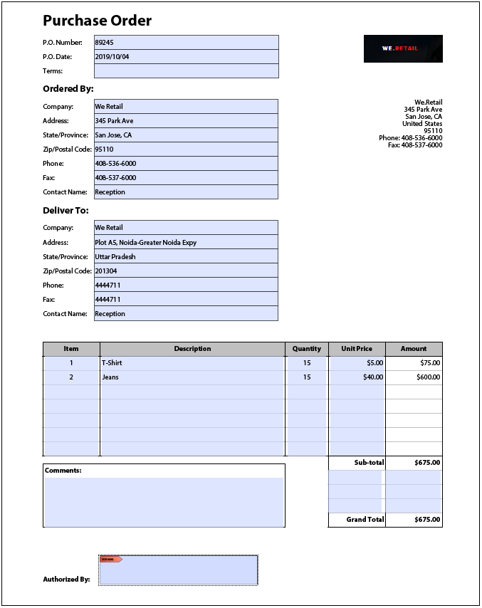

# 最佳實務和已知的複雜模式 {#Best-practices-and-considerations2}

本檔案提供表單管理員、作者和開發人員在使用時可受益的准則和建議 [!DNL Automated Forms Conversion service] (AFCS)。 此影片探討最佳實務，從準備來源表單，到修正需要加倍努力進行自動化轉換的複雜模式。 這些最佳實務共同為整體績效和成果做出貢獻 [!DNL Automated Forms Conversion service] (AFCS)。

## 最佳做法

轉換服務會轉換AEM上可用的PDF forms [!DNL Forms] 適用性表單的例項。 下列最佳實務可協助您改善轉換速度和準確性。 此外，這些最佳實務可協助您節省在轉換活動後所花費的時間。

### 上傳來源之前

您可以一次上傳所有PDF forms，也可以視需要分階段上傳。 在上傳表單前，請參閱以下提醒：

* 將資料夾中的表單數保持在15個以內，將資料夾中的總頁數保持在50個以內。
* 將資料夾的大小保持在10 MB以下。 請勿將表單放在子資料夾中。
* 將表單的頁數保持在15頁以下。
* 將來原始檔組織成批次8到15份檔案。 將具有常見最適化表單片段的來源表單保留在單一批次中。
* 請勿上傳受保護的表單。 此服務無法轉換受密碼保護和安全的表單。
* 請勿上傳 [PDFPortfolio](https://helpx.adobe.com/acrobat/using/overview-pdf-portfolios.html). 此服務無法將PDFPortfolio轉換為最適化表單。
* 請勿上傳檔案名稱中帶有空格的來源表單。 上傳表單前，請先移除檔案名稱中的空格。
* 請勿上傳任何非英文、法文、德文、西班牙文、義大利文和葡萄牙文語言的掃描、填寫和表單。 此服務不支援這些表單。

使用XDP表單進行轉換時，請先執行下列步驟，再上傳來源XPD表單：

* 分析XDP表單並修正視覺問題。 確保來原始檔使用預期的控制項和結構。 例如，來源表單可能有核取方塊，而不是單一選取範圍的選項按鈕。 將核取方塊變更為選項按鈕，以產生具有所需元件的調適型表單。
* [將繫結新增至XDP表單](http://www.adobe.com/go/learn_aemforms_designer_65_tw) 開始轉換之前。 當來源XDP表單中有繫結可用時，此服務會在轉換期間自動將繫結套用至對應的調適型表單欄位。 這可以節省您手動套用繫結所需的時間。
* [新增Adobe Sign標籤](https://helpx.adobe.com/sign/using/text-tag.html) 到XDP檔案。 此服務會自動將Adobe Sign標籤轉換為對應的最適化表單欄位。 最適化Forms支援有限數量的Adobe Sign欄位。 如需支援欄位的完整清單，請參閱 [在最適化表單中使用Adobe Sign](https://experienceleague.adobe.com/docs/experience-manager-65/forms/adaptive-forms-advanced-authoring/working-with-adobe-sign.html?lang=en) 檔案。
* 可能的話，將XDP檔案中的複雜表格轉換為簡單表格。 表格若包含表格儲存格中的表單欄位、大小不一的儲存格、跨欄或列儲存格、合併的儲存格、部分框線或無可見框線，則會視為複雜表格。 含有上述任一專案的表格會視為複雜表格。
<!-- * Use sub-forms in XDP documents to create panels in adaptive forms. Service converts each sub-form to one or more adaptive form panels during conversion. -->

### 開始轉換之前

* 建立自適應表單範本。 範本有助於為組織或部門的表單指定統一結構。
* 指定最適化表單範本中的頁首和頁尾。 此服務會忽略來原始檔的頁首頁尾，並使用最適化表單範本中指定的頁首頁尾。
* 建立最適化表單主題。 主題可讓您的組織或部門各式各樣的外觀和感覺保持一致。
* 設定表單資料模型，以儲存並擷取資料來源。 建立並設定表單資料模型的讀取和寫入服務。
* 建立最適化表單片段並設定服務，以使用您的最適化表單片段。
* 為需要業務流程自動化的表單準備通用工作流程模型。
* 視需要設定Adobe Analytics

## 瞭解複雜模式

AEM [!DNL Forms Automated Conversion service] 使用人工智慧和機器學習演演算法來瞭解來源表單的版面和欄位。 每個機器學習服務都會持續學習來源資料，並在每次流失時產生改良的輸出。 這些服務就像人類一樣，從經驗中學習。

[!DNL Automated Forms Conversion service] 已接受大量表單的訓練。 它可輕鬆識別來源表單中的欄位並產生調適型表單。 不過，PDF forms中有些欄位和樣式雖然肉眼很容易看見，但服務上卻難以理解。 此服務可將與適用欄位型別或面板不同的欄位或樣式指派給某些欄位或樣式。 以下列出所有此類欄位和樣式模式。

服務會持續從來源資料學習，開始識別並指派正確的欄位或面板給這些模式。 目前，您可以使用 [檢閱並修正](review-correct-ui-edited.md) 編輯器以修正此類問題。 在開始修正問題或進一步閱讀之前，請先熟悉 [最適化表單元件](https://helpx.adobe.com/experience-manager/6-5/forms/using/introduction-forms-authoring.html).

### 一般模式 {#general}

| 模式 | 範例 |
|--- |--- |
| **圖樣**  服務無法將填寫的PDF forms轉換為最適化表單。   **解析度**  使用空白的最適化表單。 |  |
| **圖樣**  服務可能無法識別密集表單中的文字和欄位。   **解析度**   在開始轉換之前，增加文字與密集表單欄位之間的寬度。 |  |
| **圖樣**  服務不支援掃描的表單。   **解析度**  請勿使用掃描的表單。 |  |
| **圖樣**  服務不會擷取影像中的影像和文字。   **解析度**   手動將影像或文字新增至轉換後的表單。 |  |
| **圖樣**  具有虛線或不清除邊界和框線的表格不會轉換。   **解析度**  使用具有明確邊界和框線的表格。 支援。 |  |
| **圖樣**   調適型表單不支援開箱即用的垂直文字。 因此，此服務不會將垂直文字轉換為對應的Adaptive Forms文字。   **解析度**   如有必要，請使用自適應表單編輯器新增垂直文字。 |  |

### 選擇群組  {#choice-group}

| 模式 | 解決方法 |
|--- |--- |
| **圖樣**   具有方塊或圓圈以外形狀的選擇群組選項不會轉換為對應的最適化表單元件。   **解析度**   將選擇選項形狀變更為方塊或圓形，或使用「稽核並修正」編輯器來識別形狀。 |  |

### 表單欄位 {#form-fields}

| 模式 | 解決方法 |
|--- |--- |
| **圖樣**   沒有清晰的框線，服務無法識別欄位。   **解析度**   使用檢閱和修正編輯器來識別這些欄位。 |  |
| **圖樣**   服務可能無法識別某些選擇群組表單欄位，表單底部或右側會有標題。   **解析度**   使用檢閱和修正編輯器來識別此類欄位 |  |
| **圖樣**   服務會合併或指派錯誤型別給一些彼此非常接近或沒有明確框線的表單欄位。   **解析度**   使用檢閱和修正編輯器來識別這些欄位。 |  |
| **圖樣**   服務可能無法識別含有遙遠字幕的欄位，或字幕與輸入欄位之間的虛線。   **解析度**   使用具有明確界限的表單欄位，或使用檢閱和修正編輯器來修正此類問題。 |  |

### 清單 {#lists}

| 模式 | 解決方法 |
|--- |--- |
| **圖樣**  包含表單欄位的清單會合併或未轉換為對應的最適化表單元件   **解析度**  使用具有明確界限的表單欄位，或使用檢閱和修正編輯器來修正此類問題。 |  |
| **圖樣**  服務可能會保留一些無法識別的巢狀清單   **解析度**   使用檢閱和修正編輯器來修正此類問題。 |  |
| **圖樣**   服務會將一些包含選擇群組的清單合併在一起   **解析度**   使用檢閱和修正編輯器來修正此類問題。 |  |

<!--
Comment Type: draft

<h3>Choice groups</h3>
-->

<!--
Comment Type: draft

<ul>
<li>Lists with form fields, nested lists, and nested choice groups are not supported.</li>
<li>Form fields with captions at bottom or right are not supported.</li>
<li>Form fields without borders are not supported.</li>
<li>Hidden form fields are not supported.</li>
<li>Button in PDF forms are not converted to adaptive form buttons.  </li>
<li>Tables with clear explicit boundaries and borders are supported.</li>
<li>Fields with far away captions are not supported.  </li>
<li>Choice groups with only box or circle shaped selectors are supported. </li>
</ul>
-->
