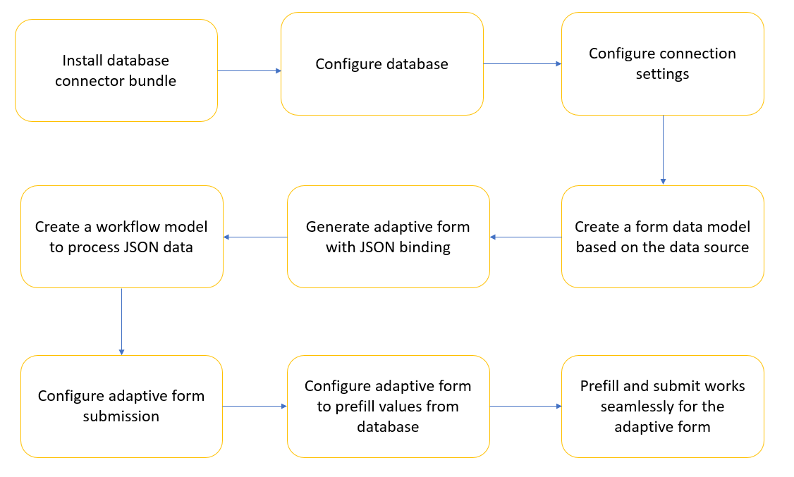

# 使用AEM工作流程整合最適化表單與資料庫 {#submit-forms-to-database-using-forms-portal}

automated forms conversion服務(AFCS)可讓您將非互動式PDF表單、Acro表單或XFAPDF表單轉換為最適化表單。 起始轉換程式時，您可以選擇產生具有或不具有資料繫結的最適化表單。

如果您選擇產生沒有資料繫結的調適型表單，則可以在轉換後整合已轉換的調適型表單與表單資料模型、XML結構描述或JSON結構描述。 對於表單資料模型，您需要手動將最適化表單欄位與表單資料模型繫結。 不過，如果您產生具有資料繫結的調適型表單，轉換服務會自動將調適型表單與JSON結構描述建立關聯，並在調適型表單和JSON結構描述中可用的欄位之間建立資料繫結。 然後，您可以將最適化表單與您選擇的資料庫整合、在表單中填寫資料，並將資料提交至資料庫。 同樣地，成功與資料庫整合後，您可以在轉換後的調適型表單中設定欄位，以從資料庫擷取值並預填調適型表單欄位。

下圖說明將轉換後的適用性表單與資料庫整合的不同階段：



本文會說明如何成功執行所有這些整合階段的逐步指示。

## 必要條件  {#pre-requisites}

* 設定AEM 6.4或6.5編寫執行個體
* 安裝 [最新Service Pack](https://helpx.adobe.com/tw/experience-manager/aem-releases-updates.html) 針對您的AEM執行個體
* 最新版本的AEM Forms附加元件套件
* 設定 [automated forms conversion服務](configure-service.md)
* 設定資料庫。 範例實作中使用的資料庫是MySQL 5.6.24。不過，您可以將轉換後的最適化表單與您選擇的任何資料庫整合。

## 最適化表單範例 {#sample-adaptive-form}

若要執行使用案例以使用AEM工作流程將轉換後的適用性表單與資料庫整合，請下載以下範例PDF檔案。

您可以使用以下下載範例「聯絡我們」表單：

[取得檔案](assets/sample_contact_us_form.pdf)

PDF檔案可作為Automated forms conversion服務(AFCS)的輸入。 此服務會將此檔案轉換為最適化表單。 下圖是以PDF格式呈現的範例連絡人表格。


## 安裝mysql-connector-java-5.1.39-bin.jar檔案 {#install-mysql-connector-java-file}

在所有作者和發佈執行個體上執行以下步驟，以安裝mysql-connector-java-5.1.39-bin.jar檔案：

1. 瀏覽至 `http://server:port/system/console/depfinder` 和搜尋com.mysql.jdbc套件。
1. 在「匯出者」欄中，檢查封裝是否由任何束匯出。 如果套件未由任何套件組合匯出，請繼續。
1. 瀏覽至 `http://server:port/system/console/bundles` 並按一下 **[!UICONTROL Install/Update]**.
1. 按一下 **[!UICONTROL Choose File]** 並瀏覽以選取mysql-connector-java-5.1.39-bin.jar檔案。 另外，選取 **[!UICONTROL Start Bundle]** 和 **[!UICONTROL Refresh Packages]** 核取方塊。
1. 按一下 **[!UICONTROL Install]** 或 **[!UICONTROL Update]**. 完成後，請重新啟動伺服器。
1. （僅限Windows）關閉作業系統的系統防火牆。

## 為表單模型準備資料 {#prepare-data-for-form-model}

AEM Forms資料整合可讓您設定並連線至不同的資料來源。 使用轉換程式產生最適化表單後，您可以根據表單資料模型、XSD或JSON結構描述定義表單模型。 您可以使用資料庫、Microsoft Dynamics或任何其他協力廠商服務來建立表單資料模型。

本教學課程使用MySQL資料庫作為建立表單資料模型的來源。 在資料庫中建立結構描述並新增 **contact** 根據最適化表單中可用的欄位形成結構描述表格。


您可以使用下列DDL陳述式來建立 **contact** 資料庫中的表格。

```sql
CREATE TABLE `contactus` (
   `name` varchar(45) NOT NULL,
   `email` varchar(45) NOT NULL,
   `phonenumber` varchar(10) DEFAULT NULL,
   `issuedesc` varchar(1000) DEFAULT NULL,
   PRIMARY KEY (`email`)
 ) ENGINE=InnoDB DEFAULT CHARSET=utf8
```

## 設定AEM執行個體與資料庫之間的連線 {#configure-connection-between-aem-instance-and-database}

執行以下設定步驟來建立AEM執行處理與MYSQL資料庫之間的連線：

1. 移至AEM Web Console設定頁面，位於 `http://server:port/system/console/configMgr`.
1. 尋找並按一下以開啟 **[!UICONTROL Apache Sling Connection Pooled DataSource]** 在「Web主控台設定」的編輯模式中。 指定特性值，如下表所述：

   <table> 
    <tbody> 
    <tr> 
    <th><strong>屬性</strong></th> 
    <th><strong>值</strong></th> 
    </tr> 
    <tr> 
    <td><p>資料來源名稱</p></td> 
    <td><p>從資料來源集區篩選驅動程式的資料來源名稱。</p></td>
    </tr>
    <tr> 
    <td><p>JDBC驅動程式類別</p></td> 
    <td><p>com.mysql.jdbc.Driver</p></td>
    </tr>
    <tr> 
    <td><p>JDBC連線URI</p></td> 
    <td><p>jdbc:mysql://[主機]：[連線埠]/[結構描述名稱]</p></td>
    </tr>
    <tr> 
    <td><p>使用者名稱</p></td> 
    <td><p>用於驗證資料庫表格並執行動作的使用者名稱</p></td>
    </tr>
    <tr> 
    <td><p>密碼</p></td> 
    <td><p>與使用者名稱關聯的密碼</p></td>
    </tr>
    <tr> 
    <td><p>交易隔離</p></td> 
    <td><p>READ_COMMITTED</p></td>
    </tr>
    <tr> 
    <td><p>最大使用中連線</p></td> 
    <td><p>1000</p></td>
    </tr>
    <tr> 
    <td><p>最大閒置連線</p></td> 
    <td><p>100</p></td>
    </tr>
    <tr> 
    <td><p>最小閒置連線</p></td> 
    <td><p>10</p></td>
    </tr>
    <tr> 
    <td><p>初始大小</p></td> 
    <td><p>10</p></td>
    </tr>
    <tr> 
    <td><p>等待上限</p></td> 
    <td><p>100000</p></td>
    </tr>
     <tr> 
    <td><p>借入時測試</p></td> 
    <td><p>已核取</p></td>
    </tr>
     <tr> 
    <td><p>閒置時測試</p></td> 
    <td><p>已核取</p></td>
    </tr>
     <tr> 
    <td><p>驗證查詢</p></td> 
    <td><p>範例值為SELECT 1(mysql)、select 1 from dual(oracle)、SELECT 1(MS Sql Server) (validationQuery)</p></td>
    </tr>
     <tr> 
    <td><p>驗證查詢逾時</p></td> 
    <td><p>10000</p></td>
    </tr>
    </tbody> 
    </table>

## 建立表單資料模型 {#create-form-data-model}

設定MYSQL做為資料來源後，請執行以下步驟來建立表單資料模型：

1. 在AEM編寫執行個體中，導覽至 **[!UICONTROL Forms]** > **[!UICONTROL Data Integrations]**.

1. 點選 **[!UICONTROL Create]** > **[!UICONTROL Form Data Model]**.

1. 在 **[!UICONTROL Create Form Data Model]** 精靈，指定 **workflow_submit** 作為表單資料模型的名稱。 點選 **[!UICONTROL Next]**.

1. 選取您在上一節中設定的MYSQL資料來源，然後點選 **[!UICONTROL Create]**.

1. 點選 **[!UICONTROL Edit]** 並展開左側窗格中列出的資料來源以選取 **contact** 表格， **[!UICONTROL get]**、和 **[!UICONTROL insert]** 服務，然後點選 **[!UICONTROL Add Selected]**.

   

1. 在右窗格中選取資料模型物件，然後點選 **[!UICONTROL Edit Properties]**. 選取 **[!UICONTROL get]** 和 **[!UICONTROL insert]** 從 **[!UICONTROL Read Service]** 和 **[!UICONTROL Write Service]** 下拉式清單。 指定讀取服務的引數，然後點選 **[!UICONTROL Done]**.

1. 在 **[!UICONTROL Services]** 索引標籤中，選取 **[!UICONTROL get]** 服務並點選 **[!UICONTROL Edit Properties]**. 選取 **[!UICONTROL Output Model Object]**，停用 **[!UICONTROL Return array]** 切換，然後點選 **[!UICONTROL Done]**.

1. 選取 **[!UICONTROL Insert]** 服務並點選 **[!UICONTROL Edit Properties]**. 選取 **[!UICONTROL Input Model Object]** 然後點選 **[!UICONTROL Done]**.

1. 點選 **[!UICONTROL Save]** 以儲存表單資料模型。

您可以使用以下下載範例表單資料模型：

[取得檔案](assets/DownloadedFormsPackage_1497728018502500.zip)

## 產生具有JSON繫結的最適化表單 {#generate-adaptive-forms-with-json-binding}

使用 [要轉換的Automated forms conversion服務(AFCS)](convert-existing-forms-to-adaptive-forms.md) 此 [聯絡我們表單](#sample-adaptive-form) 變更為具有資料繫結的最適化表單。 請勿選取 **[!UICONTROL Generate adaptive form(s) without data bindings]** 核取方塊。


選取已轉換的 **聯絡我們表單** 可在 **[!UICONTROL output]** 資料夾位置 **[!UICONTROL Forms & Documents]** 然後點選 **[!UICONTROL Edit]**. 點選 **[!UICONTROL Preview]**，在調適型表單欄位中輸入值，然後點選 **[!UICONTROL Submit]**.

登入 **crx-repository** 並導覽至 */content/forms/fp/admin/submit/data* 以檢視JSON格式提交的值。 當您提交轉換後的檔案時，以下是JSON格式的範例資料 **聯絡我們** 最適化表單：

```json
{
  "afData": {
    "afUnboundData": {
      "data": {}
    },
    "afBoundData": {
      "data": {
        "name1": "Gloria",
        "email": "abc@xyz.com",
        "phone_number": "2346578965",
        "issue_description": "Test message"
      }
    },
    "afSubmissionInfo": {
      "computedMetaInfo": {},
      "stateOverrides": {},
      "signers": {},
      "afPath": "/content/dam/formsanddocuments/docs_conversion/output/sample_form_json",
      "afSubmissionTime": "20191204014007"
    }
  }
}
```

您需要立即建立工作流程模型，以便處理此資料，並使用您在前幾節中建立的表單資料模型將其提交至MYSQL資料庫。

## 建立工作流程模型以處理JSON資料 {#create-workflow-model}

執行以下步驟來建立工作流程模型，以將最適化表單資料提交至資料庫：

1. 開啟「工作流程模型」主控台。 預設URL為 `https://server:port/libs/cq/workflow/admin/console/content/models.html/etc/workflow/models`.

1. 選取 **[!UICONTROL Create]**，然後 **[!UICONTROL Create Model]**. 此 **[!UICONTROL Add Workflow Model]** 對話方塊隨即顯示。

1. 輸入 **[!UICONTROL Title]** 和 **[!UICONTROL Name]** （選擇性）。 例如， **workflow_json_submit**. 點選 **[!UICONTROL Done]** 以建立模型。

1. 選取工作流程模型並點選 **[!UICONTROL Edit]** 以在編輯模式中開啟模型。 點選+並新增 **[!UICONTROL Invoke Form Data Model Service]** 步驟至工作流程模型。

1. 點選 **[!UICONTROL Invoke Form Data Model Service]** 逐步並點選 .

1. 在 **[!UICONTROL Form Data Model]** 標籤中，選取您在中建立的表單資料模型 **[!UICONTROL Form Data Model path]** 欄位並選取 **[!UICONTROL insert]** 從 **[!UICONTROL Service]** 下拉式清單。

1. 在 **[!UICONTROL Input for Service]** 索引標籤，選取 **[!UICONTROL Provide input data using literal, variable, or a workflow metadata, and a JSON file]** 從下拉式清單中選取 **[!UICONTROL Map input fields from input JSON]** 核取方塊，選取 **[!UICONTROL Relative to payload]**，並提供 **data.xml** 作為 **[!UICONTROL Select input JSON document using]** 欄位。

1. 在 **[!UICONTROL Service Arguments]** 區段，為表單資料模型引數提供下列值：

   

   請注意，表單資料模型欄位（例如接觸點名稱）會對應至 **afData.afBoundData.data.name1**，會參照已提交最適化表單的JSON結構描述繫結。

## 設定最適化表單提交 {#configure-adaptive-form-submission}

執行以下步驟，將最適化表單提交至您在前一節中建立的工作流程模型：

1. 選取中可用的轉換後聯絡人表格 **[!UICONTROL output]** 資料夾位置 **[!UICONTROL Forms & Documents]** 然後點選 **[!UICONTROL Edit]**.

1. 點選以開啟最適化表單屬性 **[!UICONTROL Form Container]** 然後點選 .

1. 在 **[!UICONTROL Submission]** 區段，選取 **[!UICONTROL Invoke an AEM workflow]** 從 **[!UICONTROL Submit Action]** 從下拉式清單中，選取您在前一節建立的工作流程模型，並指定 **data.xml** 在 **[!UICONTROL Data File Path]** 欄位。

1. 點選以儲存屬性。

1. 點選 **[!UICONTROL Preview]**，在調適型表單欄位中輸入值，然後點選 **[!UICONTROL Submit]**. MYSQL資料庫表格現在會顯示提交的值，而非 **crx-repository**.

## 設定最適化表單以預填資料庫的值

執行以下步驟來設定最適化表單，以根據表格中定義的主索引鍵從MYSQL資料庫預先填入值（在此案例中為電子郵件）：

1. 點選 **電子郵件** 最適化表單中的欄位並點選 .

1. 點選 **[!UICONTROL Create]** 並選取 **[!UICONTROL is changed]** 從 **[!UICONTROL Select State]** 中的下拉式清單 **[!UICONTROL When]** 區段。

1. 在 **[!UICONTROL Then]** 區段，選取 **[!UICONTROL Invoke Service]** 和 **get** 作為您在前一節建立的表單資料模型的服務。

1. 選取 **電子郵件** 在 **[!UICONTROL Input]** 區段和表單資料模型的其餘三個欄位， **名稱**， **電話號碼**、和 **問題說明** 在 **[!UICONTROL Output]** 區段。 點選 **[!UICONTROL Done]** 以儲存設定。

   

   因此，您可以根據MYSQL資料庫中現有的Email專案，預先填入 **[!UICONTROL Preview]** 最適化表單的模式。 aya.tan@xyz.com例如，如果您在 **電子郵件** 欄位（根據中的現有資料） [準備表單資料模型](#prepare-data-for-form-model) 區段)並跳出欄位，其餘三個欄位， **名稱**， **電話號碼**、和 **問題說明** 會在自適應表單中自動顯示。

您可使用以下方式下載範例轉換後的最適化表單：

[取得檔案](assets/DownloadedFormsPackage_1498226829041200.zip)
