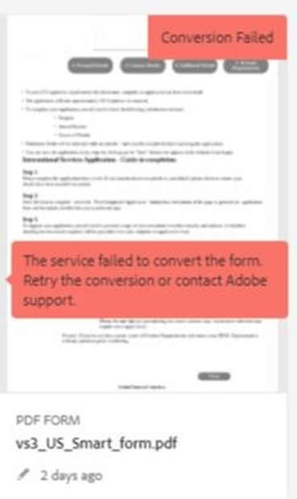

# 自動表單轉換服務疑難排解

本文件提供常見錯誤的基本疑難排解步驟。

<!--The article provides information on installation, configuration and administration issues that may arise in an Automated Forms Conversion Service production environment. -->

## 常見錯誤 {#commonerrors}

| 錯誤 | 範例 |
|--- |--- |
| **錯誤訊息**   沒有存取權杖標頭可用。   **原因**   管理員已建立了多個 IMS 組態或 IMS 組態無法連接至 Adobe Cloud 上的 AFCS 服務。   **解決方法**   如果有多個組態，請刪除所有的組態並[建立一個新的組態](configure-service.md#obtainpubliccertificates)。  如果只有一個組態，請使用「**健康情況檢查**」以[檢查連網狀態](configure-service.md#createintegrationoption)。 |  |
| **錯誤訊息**   無法連接到服務。    **原因**   服務 URL 不正確，或自動表單轉換服務雲端服務中沒有提及服務 URL。   **解決方法**   在自動表單轉換服務雲端服務中修正[服務 URL](configure-service.md#configure-the-cloud-service)。 |  |
| **錯誤訊息**   本服務未能轉換表單。    **原因**   您這端的連網問題、排程維護導致服務無法使用或 Adobe Cloud 運行中斷。   **解決方法**   解決您這端的連網問題，並在 https://status.adobe.com/ 上查看服務狀態，是否有排程維護或無預期的運行中斷。 |  |
| **錯誤訊息**   頁數超過 15 頁。    **原因**   源表單長度超過 15 頁。    **解決方法**   使用 Adobe Acrobat 來分割超過 15 頁的表單。 將表單的頁數調整為 15 頁以下。 |  |
| **錯誤訊息**   文件數量超過 15 份。    **原因**    資料夾內含超過 15 份表單。   **解決方法**   將資料夾中的表單數量調整為 15 份以下。 將資料夾中的總頁數調整為 50 頁以下。 將資料夾的大小調整為 10 MB 以下。 不要將表單放在子資料夾中。 將源表單整理為每批次 8 到 15 份表單。 |  |
| **錯誤訊息**   不支援該源檔案格式。    **原因**   內含源表單的資料夾中有一些不支援的檔案。   **解決方法**   本服務只支援 .xdp 與 .pdf 檔案。 從資料夾移除所有具有其他附檔名的檔案後，再進行轉換。 |  |
| **錯誤訊息**   不支援掃描的表單。    **原因**   PDF 表單僅內含掃描後的表單影像，不具有內容結構。   **解決方法**   本服務無法直接將掃描後的表單或表單影像轉換至最適化表單。 但是，您可以使用 Adobe Acrobat 將表單影像轉換為 PDF 表單。 然後，使用本服務將 PDF 表單轉換為最適化表單。 請總是使用高品質的表單影像在 Acrobat 中進行轉換。 這可以提升轉換的品質。 |  |
| **錯誤訊息**   不支援加密的 PDF 表單。    **原因**   資料夾內含加密的 PDF 表單。   **解決方法**   本服務不支援將加密的 PDF 表單轉換為最適化表單。 請移除加密並上傳未加密的表單，然後進行轉換。 |  |
| **錯誤訊息**  無法解析元模型 JSON 架構。    **原因**   提供給服務的 JSON 架構格式不正確、內含無效字元或使用無效的語法來匹配元件。    **解決方法**   檢查 JSON 檔案的格式。 您可以使用任何線上的 JSON 驗證程式來檢查架構的格式和結構。 請參閱[擴展預設元模型](extending-the-default-meta-model.md)文章以獲取有關元模型語法的資訊。 |  |
| **錯誤（僅限內部部署環境）**   此 **[!UICONTROL Source Language]** 選項未列出最適化表單的正確語言。   **原因**   未正確設定最適化表單的jcr：language屬性。    **解析度**   開啟CRX-DE LITE，導覽至 `/content/forms/af/`，開啟 `jcr:content` 節點，並將節點的值設定為正確的語言。 如需支援的語言清單，請參閱 [新增不支援地區設定的本地化支援](https://experienceleague.adobe.com/docs/experience-manager-65/forms/manage-administer-aem-forms/supporting-new-language-localization.html#add-localization-support-for-non-supported-locales). |  |

<!--

<table>
<thead>
<tr>
<th>Error</th>
<th>Example</th>
</tr>
</thead>
<tbody>
<tr>
<td><strong>Error Message</strong> 
 The access token header is not available. 
 <strong>Reason</strong>   An administrator has created multiple IMS configurations or IMS configuration is not able to reach AFCS service on Adobe Cloud.   <strong>Resolution</strong>   If there are multiple configurations, delete all the configurations and <a href="configure-service.md#obtainpubliccertificates">create a new configuration</a>.   If there is a single configuration, use <strong> Health Check </strong> to <a href="configure-service.md#createintegrationoption">check connectivity</a>.</td>
<td></td>
</tr>
<tr>
<td><strong>Error Message</strong>   Unable to connect to the service.    <strong>Reason</strong>   Incorrect service URL or no service URL is mentioned in Automated Forms Conversion Service cloud services.   <strong>Resolution</strong>   Correct <a href="configure-service.md#configure-the-cloud-service">Service URL</a> in Automated Forms Conversion Service Cloud services.</td>
<td></td>
</tr>
<tr>
<td><strong>Error Message</strong>   The service failed to convert the form.    <strong>Reason</strong>   Network connectivity issues at your end, the service is down due to scheduled maintenance, or outage on Adobe Cloud.   <strong>Resolution</strong>   Resolve network connectivity issues at your end and check the status of the service on <a href="https://status.adobe.com/">https://status.adobe.com/</a> for a planned or unplanned outage.</td>
<td></td>
</tr>
<tr>
<td><strong>Error Message</strong>   The number of pages is more than 15.    <strong>Reason</strong>   The source form is more than 15 pages long.    <strong>Resolution</strong>   Use Adobe Acrobat to split forms with more than 15 pages. Bring the number of pages in a form to less than 15.</td>
<td></td>
</tr>
<tr>
<td><strong>Error Message</strong>   The number of files is more than 15.    <strong>Reason</strong>    The folder contains more than 15 forms.   <strong>Resolution</strong>   Bring the number of forms in a folder to less than or equal to 15. Bring the total number of pages in a folder less than 50. Bring the size of the folder to less than 10 MB. Do not keep forms in a sub-folder. Organize source forms into a batch of 8-15 forms.</td>
<td></td>
</tr>
<tr>
<td><strong>Error Message</strong>   The source file format is not supported.    <strong>Reason</strong>   The folder containing source forms have some unsupported files.   <strong>Resolution</strong>   The service supports only .xdp and .pdf files. Remove files with any other extension from the folder and run the conversion.</td>
<td></td>
</tr>
<tr>
<td><strong>Error Message</strong>   Scanned forms are not supported.    <strong>Reason</strong>   The PDF form contains only scanned images of the form and contains no content structure.   <strong>Resolution</strong>   The service does not support converting scanned forms or an image of a form to an adaptive out-of-the-box. However, you use Adobe Acrobat to convert the image of a form to a PDF Form. Then, use the service to convert the PDF Form to an adaptive form. Always use a high-quality image of the form for conversion in Acrobat. It improves the quality of the conversion.</td>
<td></td>
</tr>
<tr>
<td><strong>Error Message</strong>   Encrypted PDF form is not supported.    <strong>Reason</strong>   The folder contains encrypted PDF forms.   <strong>Resolution</strong>   The service does not support converting an encrypted PDF form to an adaptive form. Remove the encryption, upload the non-encrypted form, and run the conversion.</td>
<td></td>
</tr>
<tr>
<td><strong>Error Message</strong>   Unable to parse meta-model JSON schema.    <strong>Reason</strong>   The JSON schema supplied to the service is not properly formatted, contains invalid characters, or uses invalid syntax to map components.    <strong>Resolution</strong>   Check the formatting of the JSON file. You can use any online JSON validator to check the formatting and structure of the schema. See, <a href="extending-the-default-meta-model.md">Extend the default meta-model</a> article for information on meta-model syntax.</td>
<td></td>
</tr>
</tbody>
</table>
-->
